# 本想让 AI 替我讲题，结果我带资组了个剧组

> 正文草稿 v5，第 1～10 章；正文结构完整，两个微信视频链接待补

从一次不太成功的父子讲题开始，我一路把编剧、美术、配音、演员和后期凑齐，临时组建了一支 AI 视频剧组。

## 一、数学题还没讲明白，血压先听懂了

我曾经对“给孩子讲数学题”这件事抱有一种不切实际的乐观。

在我的想象里，我会耐心地坐在儿子旁边，语气温和、逻辑清晰。一个苹果、两个苹果，减法的奥秘在桌面上徐徐展开。儿子认真听讲，不时点头，父子之间充满知识传递的温暖，血压计则在一旁稳定得像一件纯装饰品。


真正开始以后，现场迅速走向了另一个版本。

同一道题，我换了三种说法，他还是一脸疑惑。我越想解释清楚，声音就越大；声音越大，他越听不进去。没过多久，儿子脑袋上仿佛飘满了问号，我的血压则像接到发令枪一样，一路向上冲刺。

讲题的人最容易出现一种错觉：只要把刚才那句话再大声重复一遍，对方就会突然领悟。事实证明，音量可以放大声音，却不会自动放大理解。那一刻，我讲减法，同时也在减去失控的自信心。


冷静下来想想，这并不是孩子故意不配合。更可能的原因是，我脑子里觉得理所当然的东西，没有通过嘴巴顺利传到他那里。我们本来就不在同一个基线上，我是经过当年千锤百炼成品，他才刚刚开始学习。程序员平时可以对着机器反复调试，轮到给孩子讲题，却很容易默认对方已经安装了和自己相同的思维环境。

既然靠嘴讲暂时讲不明白，能不能换一种孩子更愿意接受的表达方式？

## 二、表达能力不够，职业技能来凑

这个念头并不是凭空出现的。

此前儿子参加研学活动时，我曾经拿活动照片做过一次小实验：先把照片转换成温暖的二维手绘动画画面，再让静态画面动起来，生成一段 AI 小短片。过程谈不上专业，但最后的效果比我预想得好，孩子也愿意看。

这次成功给了我一种朴素的自信：既然活动照片可以变成动画，那么数学题是不是也能换一种讲法？与其让爸爸继续在旁边提高音量，不如请图片、动画和声音一起上场。

仔细一算，这个方案居然有四层收益：我可以学习和体验 AI；家里多一种轻松的带娃方式；动画能够弥补我不太擅长表达的问题；最后还能发挥一点职业上的技术优势。

传统带娃靠耐心，我的耐心当时库存告急，只好临时启用技术储备。既然平时工作遇到问题会拆需求、找工具、做验证，那么家庭沟通偶尔也可以借用一下这套思路——当然，项目经理、甲方和最终用户恰好都住在同一个家里。

我当时越想越觉得合理，差不多已经提前进入了项目庆功阶段。


这大概就是“技术性带娃”：表达能力不够，职业技能来凑。至于“鸡娃”，这里只是自我调侃，不是准备给孩子再开一条流水线。我的目标仍然很简单——做个简单的小视频，我的口号是：


这里说的“超越”，当然不是准备一个人挑战专业电影工业。更准确地说，是想给自己定个稍微高一点的目标：创意上有点意思，完成度上尽量像样，整个过程也能让我真正学会点东西。

目标最终落在一件很具体的事上：把那道靠嘴没有讲明白的数学题，做成一条孩子能够看懂、也愿意看下去的动画短片。

## 三、程序员为什么不讲 AI 编程

说到这里，可能有人会问：“你不是程序员吗？现在 AI 编程这么火，为什么不讲讲自己的主业，反而跑来拍小视频？”

原因之一，是 AI 编程发展得实在太快。昨天还在流行的概念和方法，今天可能已经换了名字，明天说不定连入口都找不到。我担心文章还没有发出去，里面的知识已经先办理了退休手续。

另一个原因，是这个领域仍处于诸子百家的阶段。路线、工具和理念很多，不少讨论看起来是在交流技术，聊着聊着却很像误入了华山剑宗与气宗的路线之争。

这种题最难的地方，不是完全没有答案，而是每个人手里都有一份自己的标准答案。作为路过群众，我决定先用实际行动测试一下怎样回答最安全。

千万不要卷入不必要的江湖纷争


这并不是说 AI 编程不值得聊。恰恰相反，它很重要，我也一直在关注和实践。只是很多问题现在还没有稳定答案，与其急着站队，不如先多调研、多练几遍，少替江湖下结论。

相比之下，AI 小视频至少是我已经亲手做过、亲自踩过坑，也确实付过试错费的项目。这次就先从它讲起。

脑洞和理由都有了，下一步终于可以开拍。不过在寻找那个传说中的“生成视频”按钮之前，还有一件更重要的事：先把到底要拍什么说清楚。

## 四、开拍前，先验证MVP = Minimum Viable Product

因为事先调研过AI视频产品的参数，很多模型的限制就是15秒
第一条视频的任务很具体：给孩子讲清楚减法和“被减数”，总长 45 秒，拆成 3 段，每段固定 15 秒。人物有数字爸爸和儿子，场景放在数字小书房，道具则是一批肩负教学重任的苹果。

目标一明确，由于视频生成是要花钱的，谨慎起见，而是先做了一条 5 秒小样，越一个最便宜的模型成本大概几毛一秒。画面里只有数字爸爸一个人，台词也只有一句：“嗨，我是数字爸爸。”

这 5 秒没有剧情，却要验证三件很现实的事：数字爸爸动起来会不会突然换脸，`edge-tts` 的普通话声线听着是否合适，以及上传声音以后，人物的嘴能不能基本跟上。

- [5秒样片视频号地址](https://weixin.qq.com/sph/ASgu4Qs8Xh)

小样MVP虽然不够完美，还算及格。

我才开始给演员建立长期档案。人物母版包括正面、侧面、全身和不同表情，还要固定脸型、发型、服装、主要配色及身高比例；场景母版则锁定数字小书房的布局和色调。数字爸爸穿蓝紫色外套，儿子穿暖红色连帽外套，避免同一个家庭每到新镜头就集体换季。

声音也需要定角。数字爸爸使用 `zh-CN-YunjianNeural`，儿子使用 `zh-CN-YunxiaNeural`。第二条短片加入兔子妈妈后，她使用 `zh-CN-XiaoxiaoNeural`，合成后再通过 FFmpeg 降低 2 个半音并恢复原时长，让声音更符合角色设定。

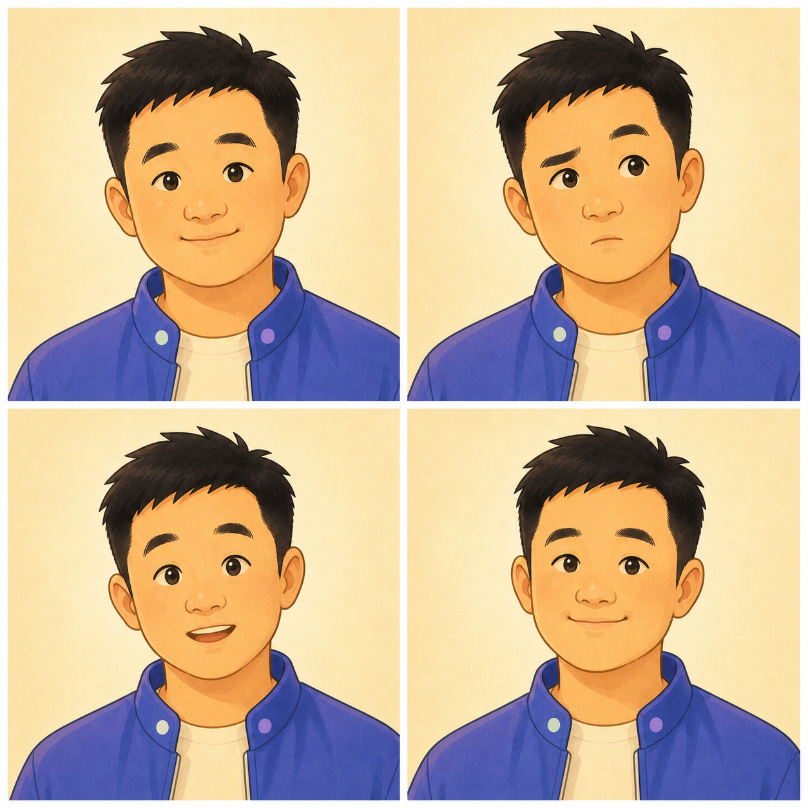
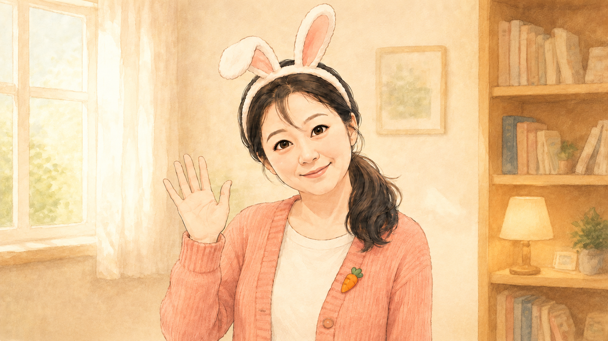
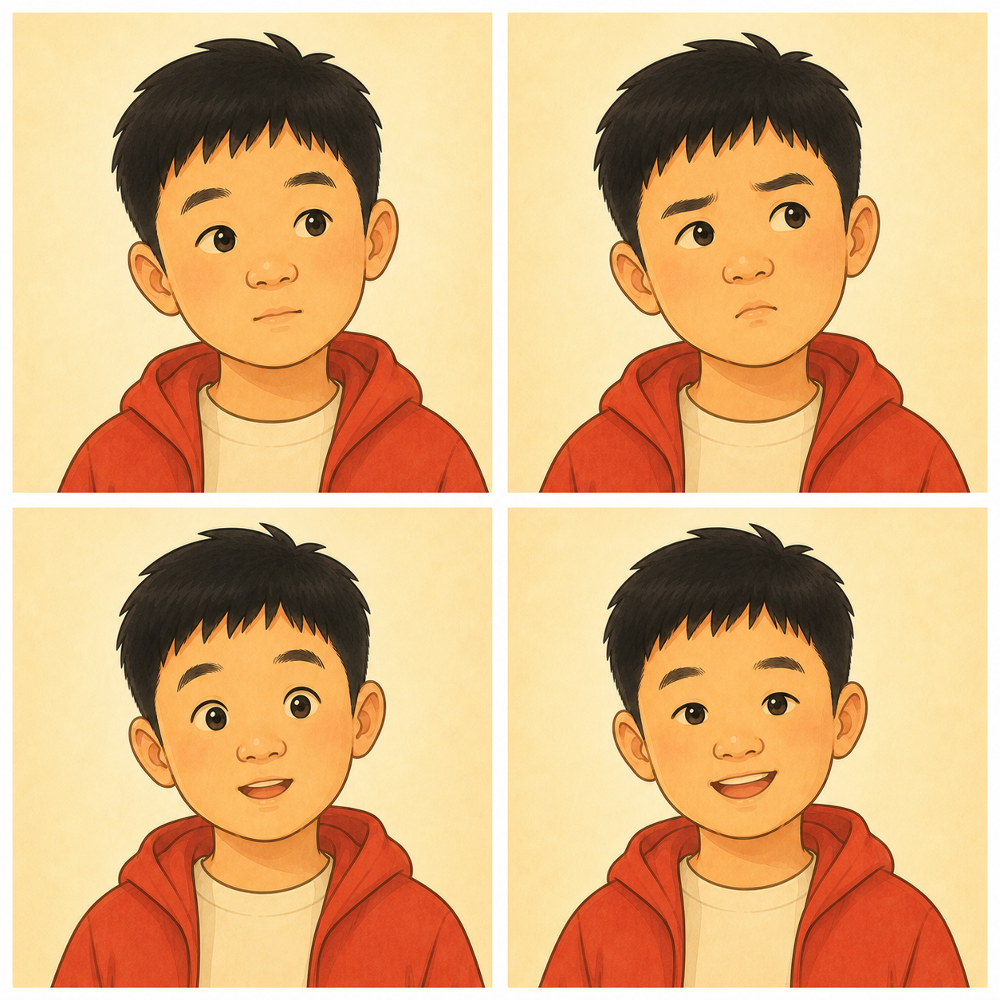
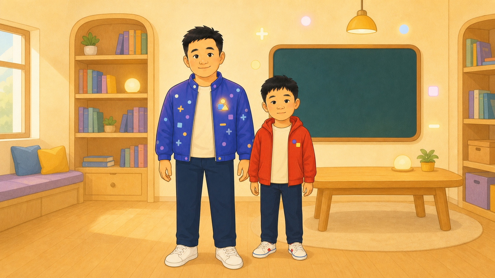

这一阶段看似还没有正式开拍，实际是在给后面减少麻烦。人物和场景一旦定稿，就相当于演员签了长期合同：后续可以换台词、换动作，但请不要每一场都重新选角。

## 五、把静态图变成分镜：AI 也怕甲方只说“自由发挥”

角色定下来以后，下一步不是让模型随便动，而是先准备关键帧。

现在的AI视频生成模型是支持文生视频或者图生视频，使用图作为参考可以让视频生成更稳定一些

第一条数学短片的每个 15 秒片段，我都准备了“开始、动作、结束”3 张 16:9 参考图，3 段合计 9 张。以第一段为例，三个状态分别是：桌面 0 个苹果，随后出现 8 个苹果，最后桌面剩 5 个、盒子里有 3 个。

> **配图占位：第一条数学短片某一段的“开始—动作—结束”三张关键帧对照。**

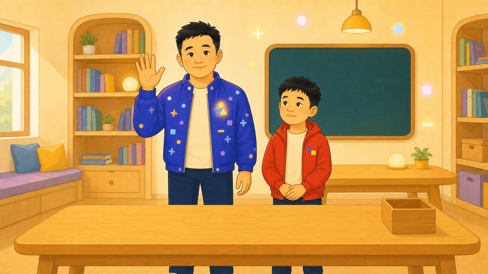
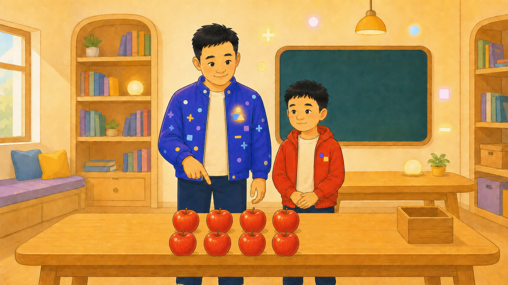
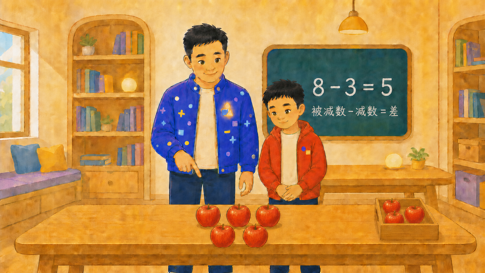

这些图片不只是告诉视频模型“请保持这个画风”，更是在规定一组必须经过的状态：人物站在哪里、苹果有几个、盒子是不是空的、动作从哪里开始又在哪里结束。数学教学视频画面再好看，苹果数量不对也只能算答案错误。

写图片提示词时，我也逐渐形成了一套固定顺序：先写人物身份和服装，再写场景与机位，然后写核心动作、道具数量和位置，最后列出不能变化的部分。提示词不一定越长越好，但甲方只说一句“你自由发挥”，AI 通常真的会自由发挥。

当然，即使已经写清楚，苹果仍可能出现在桌子棱上，对重力表现出独立见解；局部改图也可能发生“好的改坏了，坏的还在”。这些血泪先留到后面的踩坑章节，这里只说工作原则：一次只检查、修改一个最影响成片的问题，并且始终保留上一个可用版本。

到了第二条短片，素材准备明显轻松了。“理想状态”和“现实现场”已经存在，直接复用；我只补了4张缺失画面。

第二次变快，并不是因为模型突然理解了勤俭节约，而是我终于学会先翻素材库，再生成真正缺少的东西。

## 六、让画面开口：先定声音，再定时长

画面准备好以后，我采用的是“先声音、后视频”的顺序。因为现在的AI生成视频普遍支持音画同步的功能，AI视频可以严格按照录音来生成画面来说话，省去后期配音的麻烦。

虽然字节的平台里面有生成tts的功能，鉴于同事已经用过edge-tts，而且效果不错再加上免费。
我先用 `edge-tts` 分句生成语音，再让 Code Agent 编写 Python 脚本，通过 FFmpeg 完成拼接、句间停顿和必要的变调。正式音频统一输出为 24 kHz、单声道 MP3；开头留一点准备时间，每次换人前留约 0.25～0.4 秒停顿，结尾再留一段稳定画面。

每段音频还会配一份 timing JSON，记录说话角色、声线、文本、语速、句子起止时间、换人停顿和总时长。它相当于一张声音通告单：不仅告诉模型台词是什么，也说明第几秒轮到谁开口。

下面是展示部分脚本和时间线输出

```python
BASE_LINES = (
    Line(
        "提出练习",
        "数字爸爸",
        "zh-CN-YunjianNeural",
        "试一试：几减四等于六？",
        -5,
        True,
        0.30,
    ),
    Line(
        "倒过来思考",
        "数字爸爸",
        "zh-CN-YunjianNeural",
        "倒过来想，六加四等于几？",
        -5,
        True,
        0.70,
    ),
    Line(
        "儿子回答",
        "儿子",
        "zh-CN-YunxiaNeural",
        "六加四等于十，所以答案是十！",
        0,
        True,
        0.50,
    ),
    Line(
        "表扬",
        "数字爸爸",
        "zh-CN-YunjianNeural",
        "真棒！",
        -5,
        False,
        0.30,
    ),
    Line(
        "总结",
        "数字爸爸",
        "zh-CN-YunjianNeural",
        "遇到问题，换个方向，多想一步！",
        -5,
        True,
        0.80,
    ),
)
```

```json
{
  "output": "segment-03-tts-v1.mp3",
  "sample_rate_hz": 24000,
  "channels": 1,
  "maximum_duration_seconds": 14.5,
  "leading_silence_seconds": 1.2,
  "lines": [
    {
      "label": "提出练习",
      "role": "数字爸爸",
      "voice": "zh-CN-YunjianNeural",
      "text": "试一试：几减四等于六？",
      "rate": "-5%",
      "pause_after_seconds": 0.3,
      "start_seconds": 1.2,
      "end_seconds": 3.318
    },
    {
      "label": "倒过来思考",
      "role": "数字爸爸",
      "voice": "zh-CN-YunjianNeural",
      "text": "倒过来想，六加四等于几？",
      "rate": "-5%",
      "pause_after_seconds": 0.7,
      "start_seconds": 3.618,
      "end_seconds": 5.697
    },
    {
      "label": "儿子回答",
      "role": "儿子",
      "voice": "zh-CN-YunxiaNeural",
      "text": "六加四等于十，所以答案是十！",
      "rate": "+0%",
      "pause_after_seconds": 0.5,
      "start_seconds": 6.397,
      "end_seconds": 8.902
    },
    {
      "label": "表扬",
      "role": "数字爸爸",
      "voice": "zh-CN-YunjianNeural",
      "text": "真棒！",
      "rate": "-5%",
      "pause_after_seconds": 0.3,
      "start_seconds": 9.402,
      "end_seconds": 9.779
    },
    {
      "label": "总结",
      "role": "数字爸爸",
      "voice": "zh-CN-YunjianNeural",
      "text": "遇到问题，换个方向，多想一步！",
      "rate": "-5%",
      "pause_after_seconds": 0.8,
      "start_seconds": 10.079,
      "end_seconds": 12.925
    }
  ],
  "timeline_total_seconds": 13.725,
  "encoded_total_seconds": 13.776
}
```

到了视频提示词阶段，我写的已经不太像一句提示，更像一份带时间轴的拍摄通告：参考图按什么顺序使用，第几秒谁说话，另一位演员看向哪里，什么时候必须闭嘴，苹果怎样移动，最后保持什么姿势，都尽量写清楚。

```text
生成一段 15 秒、16:9 横屏的温暖二维日系手绘家庭动画。严格使用 `03-start-v1.png`、`03-action-v1.png`、`03-end-v1.png` 作为硬性关键帧，不得只参考其风格。这三个文件中的人物、构图、桌面、木盒、黑板、苹果数量和苹果排列必须按指定时间准确出现在视频里。

最高优先级是关键帧复现和苹果数量，优先于动作丰富度、手势和装饰动画。若人物动作会遮挡苹果或破坏数量，立即取消该动作，只保留父子的视线、表情、眨眼、轻微点头和参考图中的大拇指姿态。

固定正面中景机位。全片禁止切镜、推拉、摇移、旋转、变焦、裁切和景深模糊。桌面、右侧木盒和全部苹果始终完整可见、无遮挡、清楚可数。不得用人物身体、手臂、手掌、道具、画面边缘、模糊、阴影或运动残影隐藏苹果。

严格保持父子与 `03-start-v1.png`、`03-action-v1.png`、`03-end-v1.png` 为同一人物。数字爸爸的脸型、短黑发、蓝紫色外套、浅色内搭、深蓝长裤和胸前几何徽章不得改变。儿子的圆脸、短黑发、暖红色连帽外套、浅米色内搭和深蓝长裤不得改变。父子年龄、身高比例、位置、背景、桌子、黑板、木盒和光线全程稳定。

把 10 个苹果视为唯一且固定的一组对象，编号为 A1 至 A10。A1 至 A6 是 `03-start-v1.png` 中桌面上的 6 个苹果，必须始终留在桌面原位置；A7 至 A10 是 `03-start-v1.png` 中木盒里的 4 个苹果，只允许沿 `03-action-v1.png` 所示路径飞回 `03-end-v1.png` 的桌面右侧位置。全片苹果总数始终严格为 10。禁止创建、删除、复制、替换、融合、分裂、闪烁、变形、穿模或让苹果移出画面。

上传的 MP3 是全片唯一、完整且不可更改的音频。不得改写、删减、重复或新增台词，不得添加旁白、环境人声、音乐、音效或其他音轨。任一时刻只允许当前说话人开口并跟随音频匹配嘴型；另一人必须闭嘴，只用视线、点头和表情回应。换人停顿期间父子都闭嘴。严禁两人同时张嘴、抢话或出现错角色口型。

0～1.20 秒——严格复现 `03-start-v1.png`（6+4 开始关键帧）：画面必须与 `03-start-v1.png` 一致。桌面横向排列严格 6 个苹果，右侧木盒内严格 4 个苹果，总数严格 10 个。黑板保持 `? - 4 = 6`。父子闭嘴，爸爸做克制的提问手势，儿子保持思考姿态，不移动任何苹果。

1.20～3.318 秒：数字爸爸说“试一试：几减 4 等于 6？”，只有爸爸开口。他看向黑板并自然摊开一只手提出问题。儿子闭嘴，手扶下巴思考。严格保持 `03-start-v1.png` 的数量状态：桌面 6 个、盒内 4 个，总数 10 个。

3.318～3.618 秒：父子都闭嘴。爸爸把视线从黑板转向木盒，儿子继续思考。所有苹果保持不动，总数仍为 10。

3.618～5.697 秒——从 `03-start-v1.png` 准确过渡到 `03-action-v1.png`：数字爸爸说“倒过来想，6 加 4 等于几？”，只有爸爸开口，并只做 `03-action-v1.png` 中的小幅打响指动作。A7、A8、A9、A10依次离开木盒，沿 `03-action-v1.png` 所示的短弧线路径向桌面移动；A1 至 A6必须留在桌面原位置。不得复制、删除或生成苹果。到 5.697 秒时必须准确复现 `03-action-v1.png`：桌面原有 6 个苹果，空中严格 4 个苹果，木盒为空，画面总数严格 10 个；黑板保持 `? - 4 = 6`。

5.697～6.397 秒——严格保持 `03-action-v1.png`（4 个苹果返回动作关键帧）：爸爸与儿子都闭嘴，视线跟随空中 4 个苹果。完整、无遮挡地展示桌面 6 个、空中 4 个和空木盒，不得改变苹果数量或位置关系。儿子逐渐露出理解表情，准备回答。

6.397～8.902 秒——从 `03-action-v1.png` 准确过渡到 `03-end-v1.png`：儿子说“6 加 4 等于 10，所以答案是 10！”，只有儿子开口。只让空中的 A7、A8、A9、A10继续移动并分别落到 `03-end-v1.png` 桌面的 4 个固定位置；A1 至 A6不得移动、消失或被替换。儿子随着答案变得自信并逐渐竖起大拇指，数字爸爸闭嘴、微笑看着儿子。到 8.902 秒时必须准确复现 `03-end-v1.png`：桌面横向排列严格 10 个苹果，木盒为空，黑板显示 `6 + 4 = 10`，父子进入一起竖起大拇指的姿态。

8.902～9.402 秒——严格保持 `03-end-v1.png`（10 个苹果结束关键帧）：父子都闭嘴。数字爸爸微笑点头，儿子保持自信表情。桌面 10 个苹果完整可见，木盒为空，不得移动、遮挡、增加或减少任何苹果。

9.402～9.779 秒：数字爸爸说“真棒！”，只有爸爸开口，保持竖起大拇指并看向儿子。儿子闭嘴微笑。继续严格保持 `03-end-v1.png` 中的桌面 10 个苹果、空木盒和正确公式。

9.779～10.079 秒：父子都闭嘴，爸爸把视线从儿子自然转向镜头，准备总结。人物、苹果、木盒和黑板均不得变化。

10.079～12.925 秒：数字爸爸说“遇到问题，换个方向，多想一步！”，只有爸爸开口。他保持大拇指姿态并面向镜头亲切总结，不增加其他手势。儿子闭嘴并看向爸爸，轻轻点头。画面严格保持 `03-end-v1.png`：桌面 10 个苹果、木盒为空、黑板为 `6 + 4 = 10`。

12.925～13.725 秒：音频结尾静音。父子都闭嘴，动作放缓并稳定进入 `03-end-v1.png` 的结束姿态。苹果、木盒、桌面、人物和黑板不得变化。

13.725～15 秒——尽可能逐像素复现并保持 `03-end-v1.png`（10 个苹果结束关键帧）：人物位置、大拇指姿态、桌面、空木盒、10 个苹果的横向排列、黑板公式、背景、构图和光线均与 `03-end-v1.png` 一致。只允许父子自然眨眼和极轻微呼吸，禁止其他动作。

严格禁止：忽略 `03-start-v1.png`、`03-action-v1.png` 或 `03-end-v1.png`；把这些文件仅当作风格参考；改变关键帧构图；任意时刻苹果总数不是 10；A1 至 A6离开桌面；A7 至 A10没有从木盒沿 `03-action-v1.png` 的路径移动到 `03-end-v1.png` 的位置；苹果复制、删除、融合、分裂、替换、闪烁、变形、穿模、遮挡或移出画面；木盒出现错误数量；父子同时张嘴；非说话人出现说话口型；新增人物；人物换脸、变装或比例变化；镜头移动；背景漂移；黑板公式乱码、错字、抖动或变形。
```

视频采用固定的 15 秒分段，单段音频控制在 14.5 秒以内，剩余时间用于反应和稳定尾帧。生成时首轮每段只出一个版本，检查人物、口型、动作、苹果数量和关键帧；哪段失败，就只重做哪段，不让已经合格的演员集体返工。

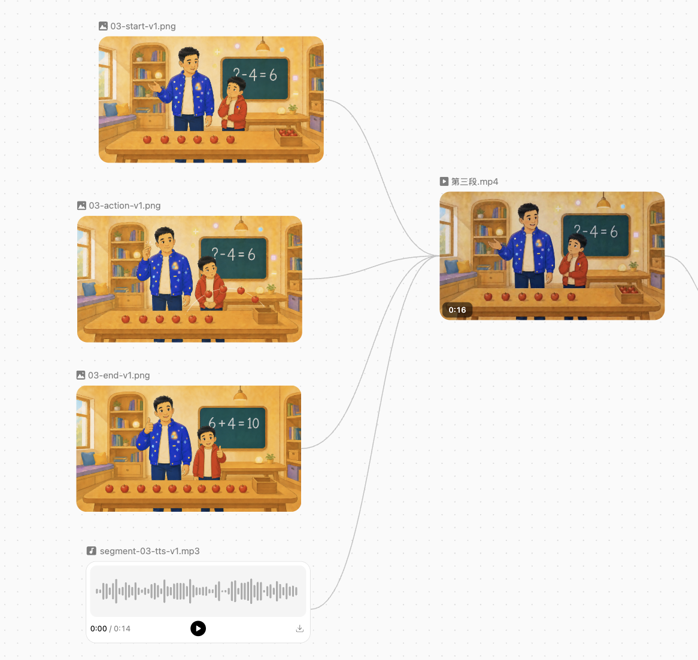

项目中实际尝试过 `Doubao-Seedance-2.0-mini`、海螺和 MiniMax Design，后续也综合使用了 MiniMax H3。这里列的是我在具体项目中的工具路径，不是模型排行榜。工具和版本会变，比较稳定的原则只有几条：参考素材要清楚，时间轴要具体，任务要拆短，禁止项要针对真正发生过的问题。

## 七、第二次为什么快了：不是 AI 进步了，是我终于会复用了

做第二条“父子讲题反差短片”时，我明显轻松了一些。并不是 AI 在两次制作之间突然完成了自我进修，而是第一次交过的学费，终于以人物、场景、声线和流程的形式返还了一部分。

| 环节 | 第一次制作 | 第二次制作 |
| --- | --- | --- |
| 人物 | 从零确定爸爸、儿子和书房 | 直接复用已验收的角色与场景 |
| 小样 | 先做 5 秒角色与口型验证 | 只验证新增人物和新能力 |
| 关键帧 | 每段准备 3 张，全套新生成 | 复用已有画面，只补缺失部分 |
| 时长 | 统一为 3 段×15 秒 | 根据正式 TTS 选择 11 秒、10 秒、9 秒 |
| 后期 | 完成片段后集中处理 | 分段烧录字幕、验收后再拼接 |

第二条短片三段正式对白的实测时长分别是 10.704 秒、9.552 秒和 8.568 秒，因此对应的视频生成时长选择 11 秒、10 秒和 9 秒。音频说完以后只保留短暂尾帧，不拖慢发音，也不临时增加一句“请大家点赞”来填满时长。

第一次制作字幕是靠微信的视频号的功能加的都是手工调整不够专业。所以在第二次加入了字幕流程。timing JSON 先生成字幕初稿，再制作每段独立的 ASS 文件。字幕画布为 1920×1080，字体使用 `Heiti SC`、字号 60，白字配 4 像素黑色描边，底部居中，下边距 90。

随后用 FFmpeg 将字幕直接烧进画面：

```bash
ffmpeg -i input.mp4 \
  -vf "subtitles=segment.ass" \
  -c:v libx264 -crf 18 -preset medium \
  -c:a copy output.mp4
```

这里的 `subtitles` 滤镜会把字幕变成视频画面的一部分，而不是添加一个播放器可以随手关闭的软字幕轨。

不过 timing JSON 只是通告单，最终成片才是现场实况。第三段生成后，实际声音和口型相对原时间轴发生偏移，我最终把两句字幕校正为 0.93～2.32 秒和 4.56～5.75 秒。最后的父子无言对视阶段则不显示字幕，让“空气突然安静”自己完成包袱。

回头看，这套制作过程可以压缩成九个普通按钮：

`脚本 → 最小验证或复用基线 → 角色母版 → 关键帧 → TTS 与时间轴 → 视频提示词 → 分段生成 → 分段硬字幕 → 拼接验收`

第二次并没有少做关键步骤，只是不用再从头发明每一个步骤。流程确实能减少意外，但还不能消灭意外。接下来就进入 AI 最擅长的环节：负责生成；以及我最熟练的环节——负责心疼。

## 八、踩坑实录：AI 负责生成，我负责心疼

前面的流程已经像模像样，但走完九步也不等于可以从容出片。AI 负责生成，我负责验收；AI 负责带来惊喜，我负责惊讶。下面五个坑，都是我亲自踩过的。

### 坑一：生图像开盲盒，数量和物理学仅供参考

AI 生图最常见的问题，不是画得不好看，而是第一眼挺好，第二眼开始不对劲。人物的手指可能临时扩编，道具数量可能自由浮动，空间关系也偶尔不太尊重现实。

数学短片里最典型的是苹果：明明要求 8 个，生成结果可能多一个、少一个，或者被手臂挡住一个。还有苹果被放在桌子棱上的情况，这让强迫症的人看得生理不适。

AI 画苹果时，不但对数量有自己的理解，对重力也偶尔有不同意见。接下来给大家看看这种翻车现场

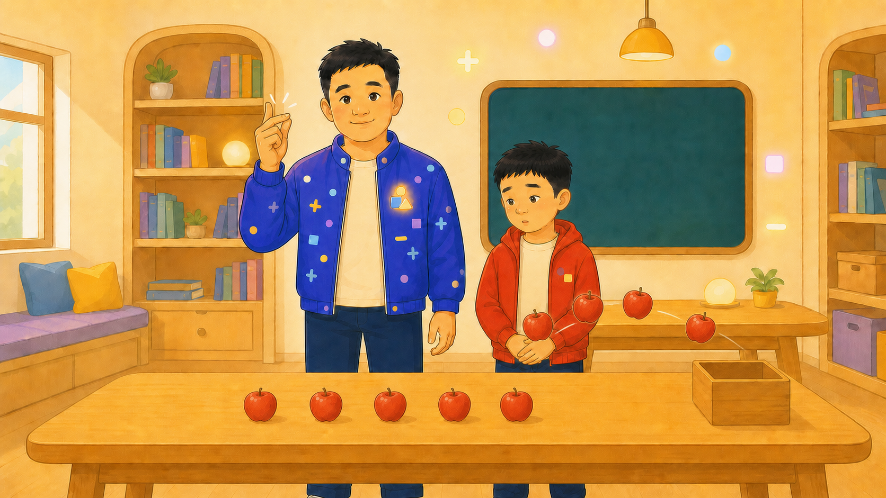
这个是飞行的苹果不对，多了一个，这个还算是不离谱的错误

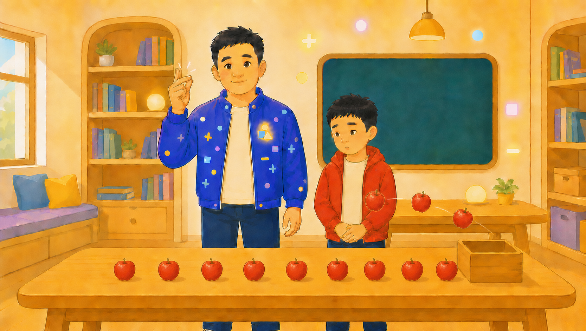
这个数量已经放飞自我了，没法看了

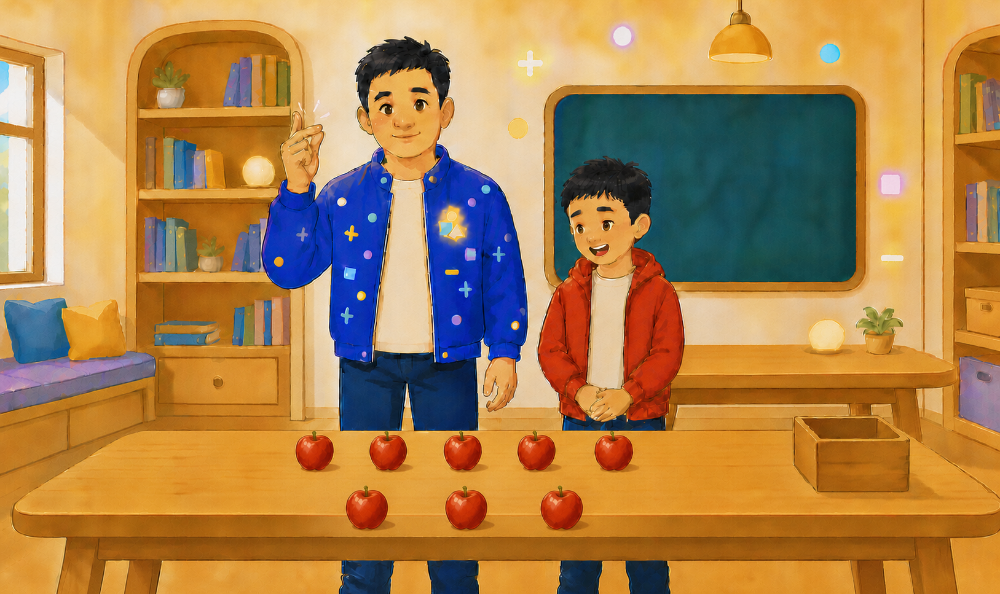
图片生成虚化了，这还是小问题！这下面的一排苹果是怎么立住的？！这个牛顿的棺材板已经按不住了！

### 坑二：局部改图，好的改坏了，坏的还在

按直觉，改图应该比重做简单：原图完成了百分之九十，只修剩下百分之十就行。

但在我的实际体验里，精细控制往往更难。明明只想改一个表情，人物的脸型、服装或背景也可能跟着变化；想修一只手，另一只原本正常的手反而出现新问题。最让人无语的是，好的地方改坏了，真正坏的地方还坚守岗位。

想修一个问题，结果收获三个新问题，这大概也是一种生成式加法。

后来我给自己定了几条规矩：一次只改一个目标，明确声明哪些部分不能动，始终保留原图，新结果使用递增版本号。如果连续修改仍然牵一发而动全身，就及时回退，改用 Photoshop、遮罩或后期合成。不是所有小瑕疵都值得重新召集整个剧组。

### 坑三：参考图不是合同，提示词也不是圣旨

做视频时，我一开始把参考图理解成合同：人物、构图和关键状态都画好了，模型只要照着让它动起来。

模型有时把它理解成了旅行建议——看过了，也表示尊重，但不一定照着走。

实际生成中，人物可能偏离参考形象，道具数量和动作顺序也可能变化，开始、动作和结束三个状态未必完整出现。遇到这种情况，人很容易继续给提示词加字：强调一次不行就强调三次，再补上一段“严格禁止”。可提示词越来越长，效果未必跟着提高。模型并不会因为我写了排比句，就突然对苹果数量产生敬畏。

更有效的办法，通常是降低任务复杂度：拆成更短的片段，减少同一时间发生的人物和动作，使用固定机位，只保留必须完成的关键状态。哪一段失败就只重做哪一段，不让已经合格的部分陪它重新投胎。

### 坑四：最现实的问题，是废片也按秒收费

图片生成失败，通常还在能够接受的试错范围内；视频生成失败，就开始心疼。

按我这次实际使用的个人体感，视频生成大约在每秒 1 元这个量级。这不是平台当前的官方统一报价，也不代表长期价格，只是本项目当时的成本记录。

最肉疼的一次，是我使用 `Doubao-Seedance-2.0` 生成一段 15 秒数学教学视频。画面并不难看，但苹果数量明显不正确。普通剧情里少一只苹果，或许还能假装没看到；数学教学里数量错了，就等于核心内容错了，整段只能作废。

于是，大约 15 元伴随着错误的苹果数量，一起离开了我的项目预算。

这次经历让我意识到，模型整体能力强，不代表每个具体任务都能一次成功。现在我会先做短样片，按片段生成，首轮只出一个版本，并提前设置停止条件。同一个问题反复强调仍没有改善，就换实现方式，不再继续用余额表达诚意。

### 坑五：嘴型对上了，时间轴却偷偷搬家了

现在的视频模型可以让人物嘴型大致跟随声音，但“嘴对上了”并不等于“整段视频严格按照剧本时间轴执行”。生成过程可能重新处理音频节奏，让一句话在最终成片里的位置偏离原 timing JSON。

第二条短片第三段就出现了这种情况：字幕初稿按照 TTS 时间制作，烧录后却明显早于实际声音和口型。嘴是对上了，时间却没完全对上——演员到了，通告单迟到了半拍。

解决办法也很朴素：timing JSON 继续用于视频提示词和字幕初稿，但视频返回后必须重新试听、重新看口型，再校正字幕与剪辑位置。通告单负责指导开拍，最终成片才是现场实况。比较视频生成花钱，调整字幕不花钱！

这五个坑指向同一件事：不要把生成结果直接当成交付结果。图片、视频、成本和时间轴，都要逐项验收。

既然没有一个工具能够独自包办全部工作，更现实的办法就是给不同工具分工，把整个剧组班子搭起来。

## 九、工具剧组：班子搭起来以后，我像是带资入组的

刚开始时，我以为自己要包办编剧、导演、美术、配音和后期。后来才发现，更现实的做法是先把临时剧组组起来。

在我的剧组里，分工大致如下：

- **Code Agent** 是制片人兼执行导演，负责整理想法、打磨剧本、拆分镜头、编写提示词和脚本、管理素材，以及在交付前提醒我再数一遍苹果。
- **ChatGPT Image Gen** 承担美术、选角和置景，负责角色母版、背景及关键帧，把散乱描述逐渐收敛成可复用的画面资产。
- **`edge-tts`** 是配音演员，按照剧本为不同角色提供声音。
- **Seedance 和 MiniMax H3** 负责摄影与动态表演，让静态角色真正动起来。
- **FFmpeg** 是后期车间，负责音频处理、字幕、编码和拼接；
- **PS 类工具**则处理那些不值得整张重做的小修小补。

视频生成最初尝试的是 Seedance。我的朴素推理是：背靠短视频平台，做短视频应该有主场优势。后续综合使用下来，我更偏向 MiniMax H3，因为在本项目的具体镜头中，它对提示词和参考图的遵从度更符合我的需要。
整条工具链压缩起来，就是：

`Code Agent 统筹 → ChatGPT 生图 → edge-tts 配音 → 视频模型让画面动起来 → FFmpeg 与 PS 收尾 → 人工验收`

工具各就各位以后，我的工作确实轻松了很多：不用自己画画，不用亲自配齐所有声音，也不用背下一整本 FFmpeg 参数。每天主要负责提要求、看样片、点头或摇头，以及在失败时继续付费。

整个状态看上去不像一个身兼数职的导演，倒很像带着想法和预算进组的投资人——作品里有我的名字，账单里也全是我的名字。

当然，“轻松了”不等于可以躺平。演员可能换脸，苹果可能擅自增员，字幕还会提前下班。每当这时，所有工具都会安静地等我拍板，充分体现了本人在剧组中的核心地位。

不过，把班子搭起来只是手段。真正值得留下的原则只有一句：让 AI 负责生成，让人负责判断什么时候已经够用了。

理论、流程和教训已经讲完，接下来请各位亲自验收这位带资入组人员交出的作业。

## 十、文末彩蛋：前面说了这么多，最后还是得看成片

### 彩蛋一：《数字爸爸的苹果减法谜题》

最初只是想认真给孩子讲一道数学题，最后先学会了怎么清点 AI 画出来的苹果。

这是第一条正式短片，也是角色定型、关键帧、TTS、分段生成和后期流程第一次完整跑通的作品。

其实还有很多瑕疵，但是成本已经不允许我再调整了，将就看看吧

- [视频号链接](https://weixin.qq.com/sph/AWH4kCdTM0)

### 彩蛋二：《理想中的父慈子孝，现实中的满头问号》

脑内讲题行云流水，现实中父子二人用沉默完成了最后的交流。

这条短片复用了第一条视频积累的人物、场景和声线，并加入动态时长、多角色配音及 ASS 硬字幕校正。

- [视频号链接](https://weixin.qq.com/sph/A7CavjKg8D)

### 彩蛋三：《是男人就坚持100秒》

这是AI生成的在线小游戏，给大家轻松娱乐下
用 React 18 + TypeScript + Vite 复刻的 Flash 时代经典弹幕躲避生存小游戏：操控小飞机在越来越密集的弹幕中存活 100 秒 即通关，中弹即死。

海报


游戏画面
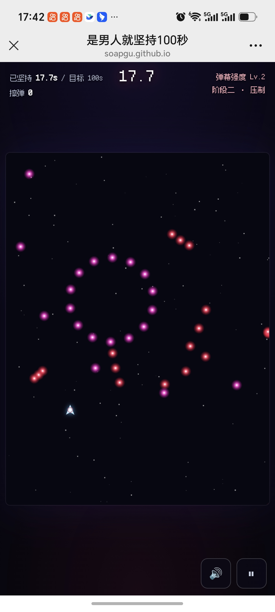


支持PC和手机一起玩哦

- [游戏入口](https://soapgu.github.io/100-second-fly/)

谁能完成100秒并在评论区截图，获取“金头盔”一枚！

攻略写到这里，理论部分正式结束。
看片不收费，生成废片的费用我已经替大家付过了。
