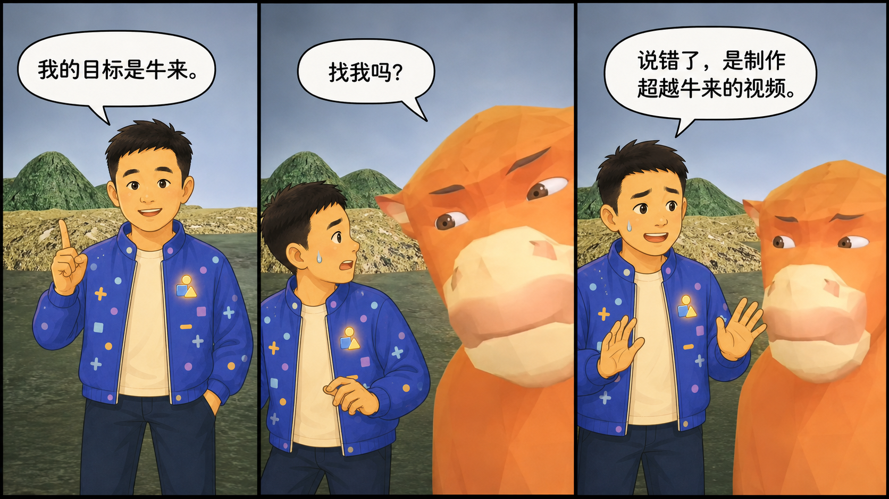
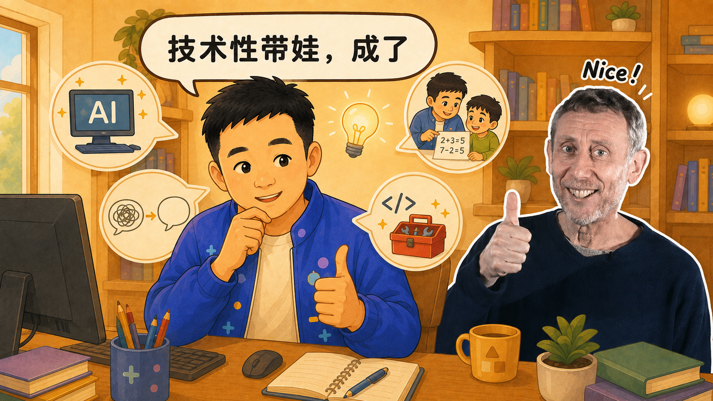
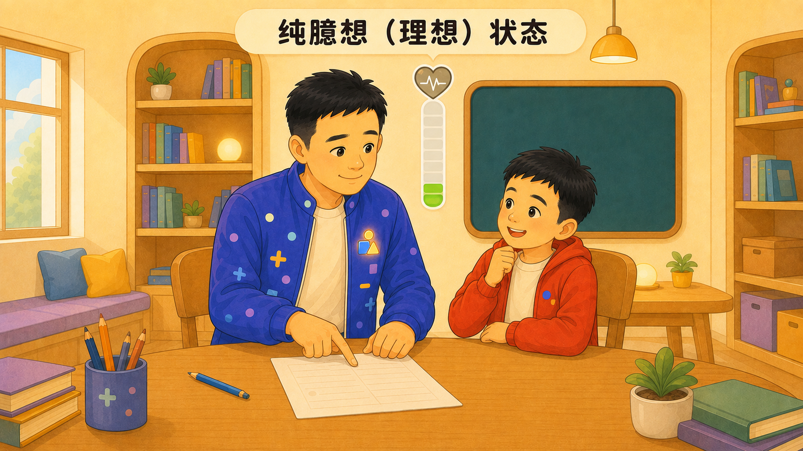
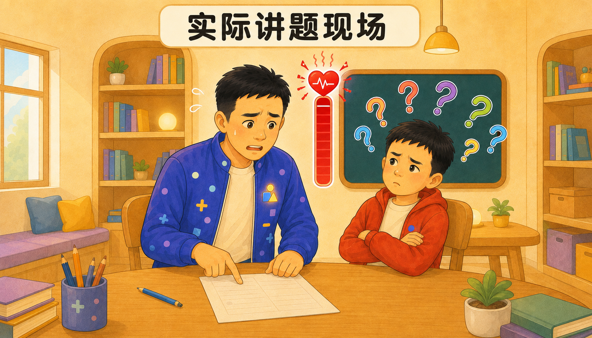
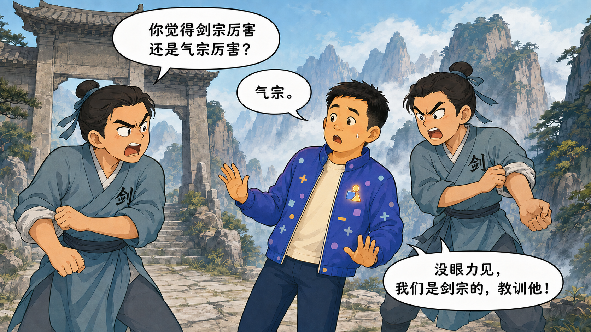
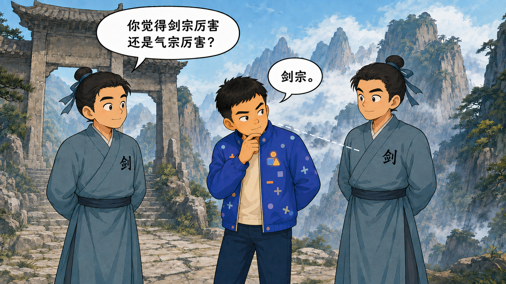
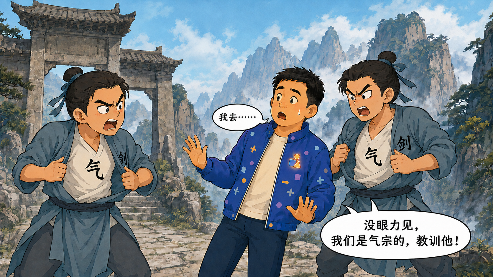

# AI 小视频攻略文章计划

> 当前阶段：碎片收集与整理。
>
> 本文件是持续更新的“活计划”，暂不追求一次写成完整文章。

## 一、文章定位

- **目标读者**：想尝试 AI 小视频、但没有相关经验的普通读者。
- **发布渠道**：公司运营的微信公众号。
- **文章形式**：中长篇真实项目复盘兼入门攻略。
- **叙述视角**：第一人称，从自己的实际制作过程出发。
- **核心主线**：一个脑洞如何跌跌撞撞地变成一条 AI 小视频。
- **写作目标**：让零基础读者既能看懂基本流程，也能提前避开一些真实踩过的坑。
- **整体语气**：轻松、幽默、有现场感，不端着，也不故意卖弄技术。
- **表达边界**：可以点名实际使用的工具并描述真实体验，但不夸大效果，不做武断比较，不把个别结果说成普遍规律。

### 内容状态说明

为避免过早把零散想法写死，本文档将内容分为三层：

1. **碎片**：未经整理的原始想法、故事、吐槽或句子。
2. **事实**：经过项目记录或实际产物核对的信息。
3. **成稿**：提纲稳定后形成的可发布段落。

当前只维护前两层。正式成稿将在素材积累充分后另行编写。

## 二、碎片灵感池

将新想法优先放在这里，尽量保留原话，不急着润色或安排顺序。

状态标记：`待整理`、`可采用`、`待核实`、`暂不采用`。

### 记录模板

```text
- [待整理] 想法或原话：
  - 可能归属：
  - 相关案例：
  - 补充说明：
```

### 当前碎片

- [可采用] 最初的目标很简单：想做个简单的小视频。
  - 可能归属：开头 / 为什么开始
  - 相关案例：数字爸爸数学短片
  - 补充说明：适合用作故事起点，与后续实际工作量形成反差；暂不展开成正式段落。

- [可采用] 目标是“牛来”——故意说错；正尴尬时，“牛来”本人走过来问：“找我吗？”我赶紧解释：“说错了，是制作超越牛来的视频。”
  - 可能归属：开头钩子 / 制作目标 / 幽默转场
  - 相关案例：文章主线的目标表达
  - 插图状态：已完成 `ai-short-video-guide/images/牛来口误-三格漫画-v1.png`。三格依次表现“我的目标是牛来”“找我吗”和“说错了，是制作超越牛来的视频”，保留低模橙牛与荒凉水岸背景，并去除参考图原有字幕和水印。
  - 补充说明：保留“牛来”的故意口误；真实目标是制作一条在创意、完成度或个人体验上超越《牛来》的视频，避免读者只看到谐音而不明白真正目标。

- [可采用] 这次尝试既完成了学习体验的记录，又能丰富家长“鸡娃”的手段；还可以借助职业上的技术优势，弥补自己不太擅长表达的问题，进行一次技术性带娃。
  - 可能归属：为什么开始 / 最终经验 / 个人动机
  - 相关案例：数字爸爸数学短片
  - 插图状态：已完成 `ai-short-video-guide/images/技术性带娃-Nice爷爷-v1.png`。数字爸爸在小书房灵感到位，与照片贴纸形式的“Nice 爷爷”并肩点赞；四个图标分别表现学习 AI、丰富带娃方法、弥补表达短板和发挥职业优势。
  - 补充说明：正式成稿可围绕“学习 AI、丰富带娃方法、弥补表达短板、发挥职业优势”四层价值展开；“鸡娃”保持轻松自嘲，不写成教育焦虑。

- [可采用] 做这个视频的直接原因，是我给儿子讲数学题的效果极差：他没听明白，也不太接受，越听越抗拒；父子之间出现小冲突，我的血压也跟着一路上升。
  - 可能归属：为什么开始 / 开头冲突 / 个人动机
  - 相关案例：数字爸爸数学短片
  - 插图状态：已完成双图对照版。图1 `ai-short-video-guide/images/父子讲题-理想状态-v2.png` 表现“纯臆想（理想）状态”，父子交流顺畅、血压保持绿色低位；图2 `ai-short-video-guide/images/父子讲题-现实现场-v2.png` 表现“实际讲题现场”，爸爸血压爆表、儿子满脑袋问号。两图人物关系仍然亲密，没有画成严厉训斥或真实对立。
  - 补充说明：这是文章很重要的真实起因。正式成稿应突出“沟通方式暂时失效”，避免把责任推给孩子，也避免渲染家庭冲突。

- [可采用] 此前儿子的研学活动中，我尝试用 AI 把照片转成宫崎骏动画风格的画面，再生成 AI 短片，实际效果还不错。这次成功经历给了我继续尝试“AI 辅助讲数学题”的基础信心。
  - 可能归属：为什么敢开始 / 前置成功经验 / 从照片到视频
  - 相关案例：儿子研学活动 AI 短片
  - 配图设想：在文章中展示研学活动的原始照片、动画化画面或最终短片片段，直观说明这次信心从哪里来。
  - 补充说明：保留“宫崎骏动画风格”作为原始经历描述；正式发布时优先改为“温暖的二维手绘动画风格”等中性表述，并提前确认孩子照片、研学活动信息和对应作品的公开授权。

- [可采用] 为什么选题做 AI 短视频，而不选现在最火的 AI 编程？你不是程序员吗，怎么不讲讲自己的主业？
  - 可能归属：选题自辩 / 为什么先聊副业、不聊主业
  - 原因一：AI 编程变化发展太快，昨天流行的概念和方法，到了今天可能已经成了陈旧知识；文章还没发，观点可能先过期，不想太快被现实打脸。
  - 原因二：现在的 AI 编程还处于诸子百家的阶段，流派和理念很多，不少讨论很像华山的“剑气之争”；在很多问题尚无定论时，不想过早站队或卷入不必要的争议。
  - 最终观点：不是不关注 AI 编程，而是它仍在快速发展。现阶段更适合多调研、多实践，积累足够经验，等方法和共识相对稳定后再认真总结。
  - 漫画设想：用四张连续的原创无厘头武侠漫画表现“认真观察后仍然选错，最后决定绕道”的尴尬；完整脚本见“华山剑气之争四连漫画”。
  - 补充说明：正式成稿要清楚区分“暂不急着下结论”和“否定 AI 编程”，避免让读者误解为回避主业或贬低相关实践。

- [待整理] AI 做小视频最像什么？可能不是“一键生成”，更像带着一群很有才华、但偶尔听不懂人话的临时演员拍片。
  - 可能归属：开头钩子 / 典型翻车
  - 相关案例：待补充
  - 补充说明：比喻可继续调整，不能为了好笑歪曲实际过程。

## 三、素材与案例池

案例记录优先回答四个问题：发生了什么、为什么重要、后来怎么处理、是否适合公开。

### 3.1 数字爸爸数学短片

- **案例状态**：已有完整项目计划和制作记录，待提炼。
- **可用方向**：
  - 从人物参考图、分镜、配音到视频生成的完整流程。
  - 角色一致性、苹果数量、公式文字和双人口型等真实难点。
  - 将一条完整视频拆成多个短片段制作，再进入后期拼接。
  - 通过减少变量、加强关键帧约束来处理生成偏差。
- **待核实内容**：具体工具版本、生成平台、参数、耗时及可公开的素材范围。
- **公开尺度**：待确认；默认只使用不涉及隐私和内部信息的过程描述。

### 3.2 兔子妈妈反差萌样片

- **案例状态**：已有角色设计、首尾帧、TTS、提示词和成片记录，待提炼。
- **可用方向**：
  - 从真人参考照片转为动画角色时，如何兼顾“像本人”和“适合动画”。
  - 用甜美开场与凶萌结尾制造短视频反差。
  - 首尾帧一致性、声音年龄感、停顿和表演节奏的调整。
  - 小样片先验证人物、声音与动作，再决定是否扩大制作规模。
- **待核实内容**：照片与画面是否可公开、工具名称和具体参数是否需要弱化。
- **公开尺度**：涉及真人参考素材，发布前必须单独确认授权与脱敏方式。

### 3.3 儿子研学活动 AI 短片

- **案例状态**：已有对应作品，具体文件位置和制作记录待补充。
- **可用方向**：
  - 从真实活动照片生成二维手绘动画画面。
  - 由静态动画化照片继续生成 AI 短片。
  - 一次效果不错的小实验，如何成为后续复杂项目的信心来源。
- **待核实内容**：使用的工具、生成步骤、实际效果、作品文件位置及可公开素材。
- **公开尺度**：涉及孩子肖像和研学活动信息，图片与视频进入文章前必须确认授权并检查背景中的个人信息。

### 3.4 案例记录模板

```text
#### 案例名称

- [事实状态：待核实]
- 最初目标：
- 实际发生：
- 解决办法：
- 得到的经验：
- 可公开程度：可公开 / 需脱敏 / 暂不公开
- 证据或项目文件：
```

## 四、候选主线与文章提纲

候选主线：**一个看起来只需要点几下的脑洞，如何经过素材准备、反复沟通和若干次翻车，最终变成一条能看的 AI 小视频。**

### 1. 为什么开始：先有脑洞，预算暂时还没有意见

- 从一次效果极差的父子讲题现场切入，不先讲工具大全。
- 用研学活动 AI 短片的成功经历，解释为什么会想到换一种表达方式。
- 说明制作目标：人物是谁、要说什么、观众看完应当记住什么。
- 主案例：数字爸爸数学短片；前置案例：儿子研学活动 AI 短片。

### 2. 为什么先聊副业，不聊主业

- 回应“程序员为什么不讲 AI 编程”的自然疑问。
- 说明 AI 编程知识更新快，过早总结容易迅速失效。
- 用“华山剑气之争”比喻尚未形成共识的流派争论。
- 收束到开放态度：继续调研和实践，不急着站队或替行业下结论。

### 3. 准备素材：AI 也怕甲方只说“你自由发挥”

- 明确人物、场景、画风、时长和核心动作。
- 准备角色参考图、关键帧、台词和必要的限制条件。
- 解释为什么“想清楚”往往比“多写提示词”更重要。

### 4. 生成角色：同一个爸爸，为什么每次都有新面孔

- 讲角色一致性问题。
- 说明如何锁定脸型、发型、服装、配色和场景。
- 使用真实案例展示逐步收敛，而不是假装一次成功。

### 5. 让角色动起来：静态图很听话，动起来就有主见了

- 从首尾帧或分镜进入视频生成。
- 说明短时长、少动作、少角色为什么更容易控制。
- 讲清参考图、动作顺序和画面连续性的作用。

### 6. 配音与口型：让该说话的人说话，居然也是技术活

- 先确定台词、声线、语速和停顿，再制作视频。
- 双人场景中明确谁在什么时候开口，避免抢话和同时张嘴。
- 将口型同步描述成现实中的取舍，不包装成完全可控。

### 7. 典型翻车：AI 没有做错，它只是有自己的理解

- 人物变脸、手部异常、物体数量错误、文字乱码、口型错位。
- 每个问题配一个真实例子和实际处理办法。
- 强调一次只修一个最影响成片的问题，避免无限重抽。

### 8. 最终经验：别追求魔法按钮，先建立可重复的流程

- 先做小样，再做完整视频。
- 将复杂目标拆成角色、画面、声音和后期几个环节。
- 接受生成环节的不确定性，把确定性留给素材和后期。
- 给零基础读者一份精简的起步清单。

## 五、幽默素材池

幽默主要来自真实经历、预期与结果的反差，以及适度自嘲。不虚构失败，不拿隐私、人物外貌或具体工具做恶意调侃。

### 候选标题

- 《我让 AI 拍了条小视频，然后开始学习怎么当导演》
- 《本以为点一下就能出片，结果我给 AI 当起了场务》
- 《从一个脑洞到一条视频：我和 AI 互相理解的漫长几分钟》

### 候选比喻与句子

- 不是不想聊主业，主要是怕文章还没发，知识先退休了。
- 现在聊 AI 编程，有时不像交流技术，更像误入华山剑气之争。
- 没有定论时，先多练几遍，少替江湖下结论。
- 数学题还没讲明白，父子俩先完成了一次情绪同步：他抗拒，我血压上升。
- 既然语言表达暂时卡住了，那就请图片、动画和 AI 一起上场。
- 上一次研学短片效果不错，给了我一种朴素的自信：这次应该也不会太离谱。
- 最初的目标很简单：做个简单的小视频。后来发现，“简单”主要负责修饰“目标”。
- 我的目标是“牛来”——不对，是制作超越牛来的视频。牛来本人甚至已经赶到现场问我是不是在找他。
- 这大概就是技术性带娃：表达能力不够，职业技能来凑。
- AI 像一位创意过剩的临时演员：发挥很好，按剧本发挥则要看心情。
- 提示词不是许愿池，字数多也不会自动提高愿望实现率。
- 静态图里的角色岁月静好，一动起来，每个人都有了自己的职业规划。
- 当画面里需要八个苹果时，AI 对“八”可能有更开放的理解。
- 先做五秒小样，是为了避免在四十五秒成片里收获四十五秒惊喜。

### 华山剑气之争四连漫画

漫画状态：已完成四张独立、风格统一的无厘头武侠漫画；使用泛武侠和华山山景，人物、服装与构图均为原创，不复刻具体影视角色、门派服装或现有作品画风。

- 图一：`ai-short-video-guide/images/华山剑气之争-01-选气宗-v1.png`
- 图二：`ai-short-video-guide/images/华山剑气之争-02-观察后选剑宗-v2.png`
- 图三：`ai-short-video-guide/images/华山剑气之争-03-翻衣露出气宗-v2.png`
- 图四：`ai-short-video-guide/images/华山剑气之争-04-绕道而行-v2.png`

#### 第一张：选气宗

- 场景：华山山门或山道，两名原创华山弟子拦住“我”；两人外衣上清楚写着“剑”。
- 弟子问：“你觉得剑宗厉害还是气宗厉害？”
- 我回答：“气宗。”
- 弟子生气：“没眼力见，我们是剑宗的，教训他！”
- 喜剧重点：我以为这是一道观点题，结果发现是一道识字题。

#### 第二张：观察后选剑宗

- 场景：保持第一张的人物、机位和华山背景。
- 两名弟子的外衣保持闭合，胸前“剑”字清楚可见，内衫“气”字完全不可见。
- 弟子再次问：“你觉得剑宗厉害还是气宗厉害？”
- 我吸取上一轮教训，认真观察弟子外衣上的“剑”字，再谨慎回答：“剑宗。”
- 弟子此时神态平静，不翻衣、不卷袖，也不说后续反驳台词。
- 喜剧重点：我以为自己通过观察找到了这道题的正确答法。

#### 第三张：翻衣露出气宗

- 场景：紧接第二张回答之后，保持相同人物和华山背景。
- 两名弟子这时才掀开外衣，露出内衫上清楚的“气”字。
- 弟子生气地说：“没眼力见，我们是气宗的，教训他！”
- 我错愕回答：“我去……”
- 不再重复提问或“剑宗。”气泡。
- 喜剧重点：刚以为掌握了规律，对方就当场换了流派。

#### 第四张：绕道而行

- 场景：远景中的华山云雾缭绕，我刚看到山门就立即转身跑走。
- 我边跑边说：“惹不起还躲不起啊！”
- 喜剧重点：不再参与没有标准答案的站队题，主动回到调研和实践。

原始碎片中的“扁他”和“我靠”予以保留作为创作来源；未来公众号成图默认使用轻度改写后的“教训他”和“我去”。

### 转场句模板

- 理论说完了，下面进入 AI 最擅长的环节：给人类一点意外。
- 到这里一切都很顺利——这句话通常意味着下一段要开始翻车了。
- 问题发现了，解决办法也很朴素：先别让它同时做那么多事。

## 六、插图资产总览

本节只展示当前正式采用的文章插图，按预计阅读顺序排列。

### 6.1 牛来口误三格漫画



用途：作为文章开头钩子，用“目标是牛来”的口误引出制作一条超越《牛来》的视频这一真实目标。

### 6.2 技术性带娃



用途：表现数字爸爸突然找到“学习 AI、改善表达、发挥职业优势、丰富带娃方式”一举多得的方案，以并肩点赞强化灵感到位的喜剧气氛。

### 6.3 父子讲题双图

#### 理想状态



用途：先展示父慈子孝、讲题顺利和血压稳定的理想画面，为下一张现实现场制造反差。

#### 现实现场



用途：承接真实讲题经历，用血压爆表和满脑袋问号表现父子沟通暂时失效。

### 6.4 华山剑气之争四连漫画

#### 第一张：选气宗



用途：数字爸爸第一次正面回答流派问题，却因为选错阵营遭遇无厘头反驳。

#### 第二张：观察后选剑宗



用途：数字爸爸吸取教训，先观察弟子外衣上的“剑”字，再谨慎选择剑宗。

#### 第三张：翻衣露出气宗



用途：弟子在答案揭晓后才翻开外衣露出“气”字，完成第二次反转。

#### 第四张：绕道而行


用途：数字爸爸不再参与没有标准答案的站队题，以远远绕开华山结束漫画。

## 七、待确认问题

- [ ] 公司公众号希望控制在什么篇幅范围？
- [ ] 是否需要结合公司业务、产品或品牌观点收束全文？
- [ ] “数字爸爸”和“兔子妈妈”两个案例是否都写，还是选择一个作为主案例？
- [ ] 真人参考照片、角色图、生成视频截图分别有哪些可以公开？
- [ ] 是否可以公开点名豆包、Seedance、海螺、Edge TTS 等实际工具？
- [ ] 具体模型名称、版本、尺寸、时长和参数是否需要写入正文？
- [ ] 是否需要补充 AI 生成内容标识、版权、肖像授权和平台规则等提醒？
- [ ] 文章最终是否需要配流程图、失败案例对比图或动图？
- [ ] 是否需要在结尾提供一份读者可直接复制的提示词模板？

未经核实的信息继续保留“待核实”标记，不进入正式发布稿。

## 八、分阶段清单

### 阶段一：收集碎片

- [ ] 持续记录故事、段子、感受、技巧和吐槽。
- [ ] 为每条碎片添加状态与可能归属。
- [ ] 不要求句子完整，不提前统一文风。

### 阶段二：主题归类

- [ ] 将碎片归入动机、素材、角色、视频、声音、翻车和经验等主题。
- [ ] 合并重复观点，保留最具体、最有画面的版本。
- [ ] 区分亲历事实、个人感受和通用建议。

### 阶段三：提纲确认

- [ ] 确定主案例与辅助案例。
- [ ] 确定文章标题、开头钩子和结尾观点。
- [ ] 确定篇幅及各章节的大致比重。

### 阶段四：分段草稿

- [ ] 每次只完成一个章节。
- [ ] 每个核心建议尽量配一个真实场景。
- [ ] 技术细节以零基础读者能够理解和使用为准。

### 阶段五：通篇串联

- [ ] 统一第一人称叙述视角。
- [ ] 调整章节顺序、转场和信息重复。
- [ ] 控制幽默密度，避免每段都强行抖包袱。

### 阶段六：事实核查

- [ ] 核对工具名称、模型版本、参数和项目事实。
- [ ] 确认图片、人物和案例的公开授权。
- [ ] 删除或改写无法证实的效果结论。

### 阶段七：公众号润色

- [ ] 优化标题、摘要和开头前三段。
- [ ] 将长段落拆成适合手机阅读的短段落。
- [ ] 补齐小标题、重点句、配图位置和图注。
- [ ] 完成公司口径、错别字和发布前终审。

## 九、协作约定

- 后续每次可以只增加一两个碎片，不要求一次讲完整。
- 新内容默认先进入“碎片灵感池”，未经确认不直接改写成正式结论。
- 素材积累到足以支撑某个章节时，再将相关内容整理进提纲。
- 提纲稳定后分章节写作，不一次性生成全文。
- 最后统一处理标题、开头、节奏、幽默密度和微信公众号排版。
- 本计划只服务于文章筹备，不改动现有视频项目计划和媒体素材。
