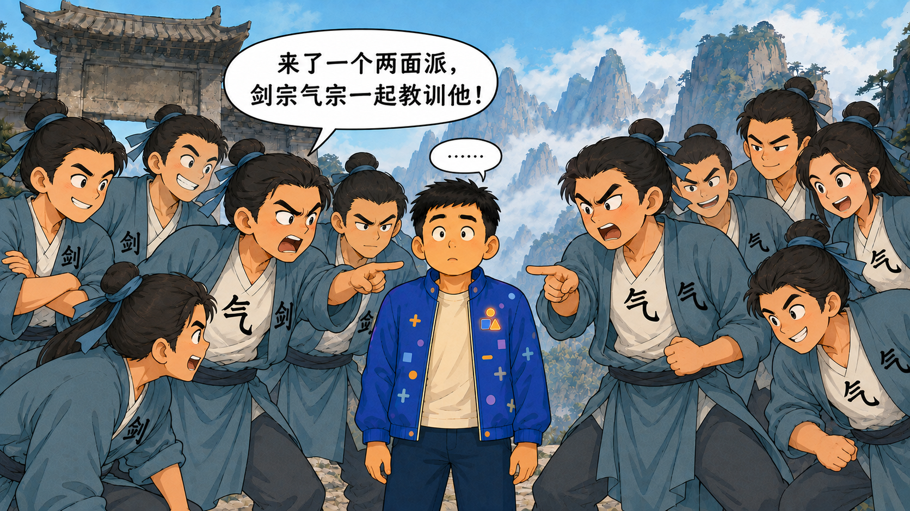
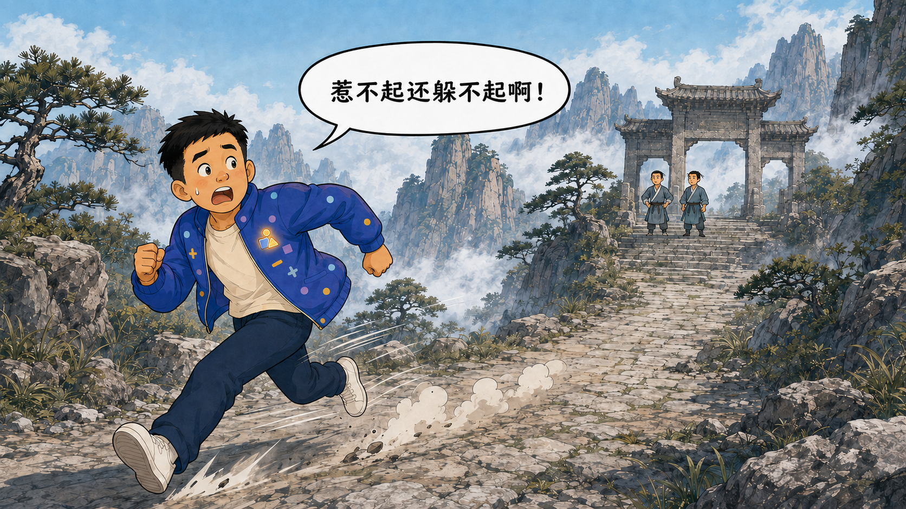

# AI 小视频攻略文章计划

> 当前阶段：文脉与提纲已定稿，进入分章写作阶段。
>
> 本文件是持续更新的“活计划”；正式提纲已经锁定，后续按章节逐步成文。

## 一、文章定位

- **目标读者**：想尝试 AI 小视频、但没有相关经验的普通读者。
- **发布渠道**：公司运营的微信公众号。
- **文章形式**：中长篇真实项目复盘兼入门攻略。
- **叙述视角**：第一人称，从自己的实际制作过程出发。
- **核心主线**：一个脑洞如何跌跌撞撞地变成一条 AI 小视频。
- **写作目标**：让零基础读者既能看懂基本流程，也能提前避开一些真实踩过的坑。
- **整体语气**：轻松、幽默、有现场感，不端着，也不故意卖弄技术。
- **表达边界**：可以点名实际使用的工具并描述真实体验，但不夸大效果，不做武断比较，不把个别结果说成普遍规律。

### 内容状态说明

为避免过早把零散想法写死，本文档将内容分为三层：

1. **碎片**：未经整理的原始想法、故事、吐槽或句子。
2. **事实**：经过项目记录或实际产物核对的信息。
3. **成稿**：提纲稳定后形成的可发布段落。

三层内容均已开始维护。现有分段草稿将按正式提纲继续修改和串联，事实核查仍在发布前单独完成。

## 二、碎片灵感池

将新想法优先放在这里，尽量保留原话，不急着润色或安排顺序。

状态标记：`待整理`、`可采用`、`待核实`、`暂不采用`。

### 记录模板

```text
- [待整理] 想法或原话：
  - 可能归属：
  - 相关案例：
  - 补充说明：
```

### 当前碎片

- [可采用] 最初的目标很简单：想做个简单的小视频。
  - 最终归属：第2章“脑洞：表达能力不够，职业技能来凑”
  - 相关案例：数字爸爸数学短片
  - 补充说明：适合用作故事起点，与后续实际工作量形成反差；暂不展开成正式段落。

- [可采用] 目标是“牛来”——故意说错；正尴尬时，“牛来”本人走过来问：“找我吗？”我赶紧解释：“说错了，是制作超越牛来的视频。”
  - 最终归属：第2章“脑洞：表达能力不够，职业技能来凑”
  - 相关案例：文章主线的目标表达
  - 插图状态：已完成 `ai-short-video-guide/images/牛来口误-三格漫画-v1.png`。三格依次表现“我的目标是牛来”“找我吗”和“说错了，是制作超越牛来的视频”，保留低模橙牛与荒凉水岸背景，并去除参考图原有字幕和水印。
  - 补充说明：保留“牛来”的故意口误；真实目标是制作一条在创意、完成度或个人体验上超越《牛来》的视频，避免读者只看到谐音而不明白真正目标。

- [可采用] 这次尝试既完成了学习体验的记录，又能丰富家长“鸡娃”的手段；还可以借助职业上的技术优势，弥补自己不太擅长表达的问题，进行一次技术性带娃。
  - 最终归属：第2章“脑洞：表达能力不够，职业技能来凑”
  - 相关案例：数字爸爸数学短片
  - 插图状态：已完成 `ai-short-video-guide/images/技术性带娃-Nice爷爷-v1.png`。数字爸爸在小书房灵感到位，与照片贴纸形式的“Nice 爷爷”并肩点赞；四个图标分别表现学习 AI、丰富带娃方法、弥补表达短板和发挥职业优势。
  - 补充说明：正式成稿可围绕“学习 AI、丰富带娃方法、弥补表达短板、发挥职业优势”四层价值展开；“鸡娃”保持轻松自嘲，不写成教育焦虑。

- [可采用] 做这个视频的直接原因，是我给儿子讲数学题的效果极差：他没听明白，也不太接受，越听越抗拒；父子之间出现小冲突，我的血压也跟着一路上升。
  - 最终归属：第1章“开场：数学题还没讲明白，血压先听懂了”
  - 相关案例：数字爸爸数学短片
  - 插图状态：已完成双图对照版。图1 `ai-short-video-guide/images/父子讲题-理想状态-v2.png` 表现“纯臆想（理想）状态”，父子交流顺畅、血压保持绿色低位；图2 `ai-short-video-guide/images/父子讲题-现实现场-v2.png` 表现“实际讲题现场”，爸爸血压爆表、儿子满脑袋问号。两图人物关系仍然亲密，没有画成严厉训斥或真实对立。
  - 补充说明：这是文章很重要的真实起因。正式成稿应突出“沟通方式暂时失效”，避免把责任推给孩子，也避免渲染家庭冲突。

- [可采用] 此前儿子的研学活动中，我尝试用 AI 把照片转成宫崎骏动画风格的画面，再生成 AI 短片，实际效果还不错。这次成功经历给了我继续尝试“AI 辅助讲数学题”的基础信心。
  - 最终归属：第2章“脑洞：表达能力不够，职业技能来凑”
  - 相关案例：儿子研学活动 AI 短片
  - 配图设想：在文章中展示研学活动的原始照片、动画化画面或最终短片片段，直观说明这次信心从哪里来。
  - 补充说明：保留“宫崎骏动画风格”作为原始经历描述；正式发布时优先改为“温暖的二维手绘动画风格”等中性表述，并提前确认孩子照片、研学活动信息和对应作品的公开授权。

- [可采用] 为什么选题做 AI 短视频，而不选现在最火的 AI 编程？你不是程序员吗，怎么不讲讲自己的主业？
  - 最终归属：第3章“插曲：程序员为什么不讲 AI 编程”
  - 原因一：AI 编程变化发展太快，昨天流行的概念和方法，到了今天可能已经成了陈旧知识；文章还没发，观点可能先过期，不想太快被现实打脸。
  - 原因二：现在的 AI 编程还处于诸子百家的阶段，流派和理念很多，不少讨论很像华山的“剑气之争”；在很多问题尚无定论时，不想过早站队或卷入不必要的争议。
  - 最终观点：不是不关注 AI 编程，而是它仍在快速发展。现阶段更适合多调研、多实践，积累足够经验，等方法和共识相对稳定后再认真总结。
  - 漫画设想：用六张连续的原创无厘头武侠漫画表现“认真观察、折中回答却仍然选错，最后决定绕道”的尴尬；完整脚本见“华山剑气之争六连漫画”。
  - 补充说明：正式成稿要清楚区分“暂不急着下结论”和“否定 AI 编程”，避免让读者误解为回避主业或贬低相关实践。

- [可采用] AI 做小视频最像什么？可能不是“一键生成”，更像带着一群很有才华、但偶尔听不懂人话的临时演员拍片。
  - 最终归属：第8章“踩坑实录”和第9章“工具剧组”之间的转场
  - 相关案例：待补充
  - 补充说明：比喻可继续调整，不能为了好笑歪曲实际过程。

## 三、素材与案例池

案例记录优先回答四个问题：发生了什么、为什么重要、后来怎么处理、是否适合公开。

### 3.1 数字爸爸数学短片

- **案例状态**：已有完整项目计划和制作记录；完整操作流程已提炼为“我的实际流程：把 AI 的魔法按钮拆成九个普通按钮”。
- **可用方向**：
  - 从人物参考图、分镜、配音到视频生成的完整流程。
  - 角色一致性、苹果数量、公式文字和双人口型等真实难点。
  - 将一条完整视频拆成多个短片段制作，再进入后期拼接。
  - 通过减少变量、加强关键帧约束来处理生成偏差。
- **待核实内容**：具体工具版本、生成平台、参数、耗时及可公开的素材范围。
- **公开尺度**：待确认；默认只使用不涉及隐私和内部信息的过程描述。

### 3.2 父子讲题反差短片

- **案例状态**：已有角色、参考图、TTS、提示词、三段视频和 ASS 硬字幕制作记录；流程优化经验已提炼进分段草稿。
- **可用方向**：
  - 复用已经验收的数字爸爸、儿子、数字小书房和正式声线，不重复从零定妆和验证。
  - 根据正式 TTS 的实际长度，将三段视频分别设置为 11 秒、10 秒和 9 秒，不再统一拉长到 15 秒。
  - 只生成缺少的关键帧，已有“理想状态”和“现实现场”插图直接复用。
  - 使用 ASS 和 FFmpeg 分段烧录硬字幕；字幕初稿来自 timing JSON，最终根据生成视频中的实际声音和口型校正。
- **真实踩坑**：第三段生成视频中的音频节奏相对原 timing JSON 发生偏移，字幕最终调整为 0.93～2.32 秒和 4.56～5.75 秒；无言对视阶段保持无字幕。
- **公开尺度**：待确认；涉及兔子妈妈和儿子形象的素材，发布前需确认授权。

### 3.3 兔子妈妈反差萌样片

- **案例状态**：已有角色设计、首尾帧、TTS、提示词和成片记录，待提炼。
- **可用方向**：
  - 从真人参考照片转为动画角色时，如何兼顾“像本人”和“适合动画”。
  - 用甜美开场与凶萌结尾制造短视频反差。
  - 首尾帧一致性、声音年龄感、停顿和表演节奏的调整。
  - 小样片先验证人物、声音与动作，再决定是否扩大制作规模。
- **待核实内容**：照片与画面是否可公开、工具名称和具体参数是否需要弱化。
- **公开尺度**：涉及真人参考素材，发布前必须单独确认授权与脱敏方式。

### 3.4 儿子研学活动 AI 短片

- **案例状态**：已有对应作品，具体文件位置和制作记录待补充。
- **可用方向**：
  - 从真实活动照片生成二维手绘动画画面。
  - 由静态动画化照片继续生成 AI 短片。
  - 一次效果不错的小实验，如何成为后续复杂项目的信心来源。
- **待核实内容**：使用的工具、生成步骤、实际效果、作品文件位置及可公开素材。
- **公开尺度**：涉及孩子肖像和研学活动信息，图片与视频进入文章前必须确认授权并检查背景中的个人信息。

### 3.5 案例记录模板

```text
#### 案例名称

- [事实状态：待核实]
- 最初目标：
- 实际发生：
- 解决办法：
- 得到的经验：
- 可公开程度：可公开 / 需脱敏 / 暂不公开
- 证据或项目文件：
```

## 四、正式主线与文章提纲

> **提纲状态：正式提纲 v2。** 全文调整为十章；后续允许调整标题和段落表达，不再改变主线。

- **暂定标题**：《本想让 AI 替我讲题，结果我带资组了个剧组》
- **内容比例**：故事约六成，攻略约四成。
- **完整文脉**：`讲题失败 → 技术性带娃 → 解释选题 → 第一次开拍 → 建立流程 → 第二次优化 → 五类翻车 → 工具剧组 → 成片彩蛋`

### 1. 开场：数学题还没讲明白，血压先听懂了

- 从真实父子讲题现场切入：理想中父慈子孝，现实中儿子满头问号、爸爸血压爆表。
- 强调问题是自己的表达方式暂时失效，不把责任推给孩子。
- 插入“父子讲题：理想状态 → 现实现场”双图。
- 以“有没有别的表达方式”引出 AI 视频。

### 2. 脑洞：表达能力不够，职业技能来凑

- 回顾研学活动照片转动画、再生成短片的成功经历。
- 提出“技术性带娃”：学习 AI、丰富带娃方式、弥补表达短板、发挥职业优势。
- 插入“技术性带娃，成了”Nice 爷爷插图。
- 用“制作超越《牛来》的视频”说明目标，插入牛来口误三格漫画。
- 将脑洞落到具体任务：制作一条孩子能够看懂的数学动画短片。

### 3. 插曲：程序员为什么不讲 AI 编程

- 回应“为什么不讲主业”的疑问。
- 分别说明知识变化快、流派争议尚未形成共识两个原因。
- 插入华山剑气之争六连漫画。
- 明确不是否定 AI 编程，而是先多调研、多实践，暂不替江湖下结论。
- 控制篇幅，作为开篇后的幽默插曲，不阻断制作主线。

### 4. 开拍前：先别找魔法按钮，先把剧本说清楚

- 确定受众、教学目标、人物、场景、时长和情绪节奏。
- 将第一条数学视频拆为 3 段×15 秒。
- 先做“嗨，我是数字爸爸”5 秒小样，验证人物、声线和口型。
- 建立数字爸爸、儿子、兔子妈妈及数字小书房母版。
- 提炼原则：新能力先做最小验证，已经验证的资产直接复用。

### 5. 把静态图变成分镜：AI 也怕甲方只说“自由发挥”

- 介绍角色定型、背景确认和关键帧制作。
- 每段明确开始、动作、结束状态，锁定人物位置和苹果数量。
- 第二条短片复用已有画面，只补缺失关键帧。
- 图片提示词固定人物身份、服装、场景、动作和禁止项。
- 简要预告数量、手部、空间关系和局部改图问题，完整吐槽留到第 8 章。

### 6. 让画面开口：先定声音，再让视频服从时间轴

- 使用 `edge-tts` 分句生成 MP3，通过脚本管理声线、语速、停顿和变调。
- 输出 timing JSON，为视频分镜和字幕提供初始时间。
- 将视频提示词写成“拍摄通告”：说话人、时间、动作、视线、闭嘴区间和尾帧。
- 分段生成视频，失败时只重做对应片段。
- 点名 Seedance、海螺和 MiniMax H3，只陈述项目体验，不做普遍排名。

### 7. 第二次为什么快了：不是 AI 进步了，是我终于会复用了

- 复用已经验收的人物、场景、声线和关键帧。
- 跳过重复的 5 秒角色小样，只验证新增人物和能力。
- 视频长度跟随正式对白，第二条短片采用约 11 秒、10 秒、9 秒的动态分段。
- 根据 timing JSON 生成 ASS 字幕，分段烧录硬字幕后再拼接。
- 记录第三段字幕重新校正为 0.93～2.32 秒和 4.56～5.75 秒。
- 给出零基础读者可以照着执行的九步操作流程。
- 对应现有分段草稿 10.1，串联全文时重点保留“第二次为什么更快”。

### 8. 踩坑实录：AI 负责生成，我负责心疼

- 按“实际现象—项目案例—处理经验”展开生图数量与物理关系、局部改图连带破坏、视频忽略参考图、按秒产生废片成本、口型与剧本时间轴偏移五类问题。
- 保留 15 秒错误苹果约损失 15 元的个人案例，并明确价格不是平台统一结论。
- 每个吐槽后给出可执行建议和停止继续抽卡的条件。
- 对应现有分段草稿 10.2。

### 9. 工具剧组：班子搭起来以后，我像是带资入组的

- Code Agent 是制片人兼执行导演；ChatGPT 负责美术、选角、背景和关键帧；`edge-tts` 负责配音；Seedance / MiniMax H3 负责摄影和表演；FFmpeg 负责字幕、音频、编码和拼接；PS 类工具负责小修小补。
- 强化“作品里有我的名字，账单里也全是我的名字”的带资入组包袱。
- 用完整工具接力链结束本章，不写成产品排行榜。
- 只保留一句最终原则：“让 AI 负责生成，让人负责判断什么时候已经够用了。”随后直接邀请读者验收成片。
- 对应现有分段草稿 10.3。

### 10. 文末彩蛋：前面说了这么多，最后还是得看成片

采用两张“故事回看卡片”，不只放裸链接。

#### 彩蛋一：数字爸爸数学短片

- **暂定作品名**：《数字爸爸的苹果减法谜题》
- **一句话介绍**：最初想认真给孩子讲一道数学题，最后先学会了怎么数 AI 画出来的苹果。
- **制作亮点**：第一条正式短片，完成角色、关键帧、TTS、视频生成和分段制作的基础流程。
- **链接状态**：待补微信视频链接；获得真实 URL 后再添加“点击观看”链接。

#### 彩蛋二：父子讲题反差短片

- **暂定作品名**：《理想中的父慈子孝，现实中的满头问号》
- **一句话介绍**：脑内讲题行云流水，现实中父子二人用沉默完成了最后的交流。
- **制作亮点**：复用第一条视频的角色和流程，加入动态时长、多角色配音及 ASS 硬字幕校正。
- **链接状态**：待补微信视频链接；获得真实 URL 后再添加“点击观看”链接。

#### 彩蛋收尾

> 攻略写到这里，理论部分已经结束。至于这些工具最后有没有听话，欢迎点击成片，亲自检查这位带资进组人员的工作成果。

两个微信链接当前只作为待补素材，不虚构 URL，也不使用项目内本地视频路径代替。获得链接后检查公众号编辑器能否正常点击、是否需要登录，以及是否存在有效期或访问范围限制。

## 五、幽默素材池

幽默主要来自真实经历、预期与结果的反差，以及适度自嘲。不虚构失败，不拿隐私、人物外貌或具体工具做恶意调侃。

### 候选标题

- 《我让 AI 拍了条小视频，然后开始学习怎么当导演》
- 《本以为点一下就能出片，结果我给 AI 当起了场务》
- 《从一个脑洞到一条视频：我和 AI 互相理解的漫长几分钟》

### 候选比喻与句子

- 不是不想聊主业，主要是怕文章还没发，知识先退休了。
- 现在聊 AI 编程，有时不像交流技术，更像误入华山剑气之争。
- 没有定论时，先多练几遍，少替江湖下结论。
- 数学题还没讲明白，父子俩先完成了一次情绪同步：他抗拒，我血压上升。
- 既然语言表达暂时卡住了，那就请图片、动画和 AI 一起上场。
- 上一次研学短片效果不错，给了我一种朴素的自信：这次应该也不会太离谱。
- 最初的目标很简单：做个简单的小视频。后来发现，“简单”主要负责修饰“目标”。
- 我的目标是“牛来”——不对，是制作超越牛来的视频。牛来本人甚至已经赶到现场问我是不是在找他。
- 这大概就是技术性带娃：表达能力不够，职业技能来凑。
- AI 像一位创意过剩的临时演员：发挥很好，按剧本发挥则要看心情。
- 提示词不是许愿池，字数多也不会自动提高愿望实现率。
- AI 画苹果时，不但对数量有自己的理解，对重力也偶尔有不同意见。
- 想修一个问题，结果收获三个新问题：好的改坏了，坏的还在。
- 我把参考图当合同，模型有时把它当成了旅行建议。
- 嘴是对上了，时间却没完全对上——演员到了，通告单迟到了半拍。
- 静态图里的角色岁月静好，一动起来，每个人都有了自己的职业规划。
- 当画面里需要八个苹果时，AI 对“八”可能有更开放的理解。
- 先做五秒小样，是为了避免在四十五秒成片里收获四十五秒惊喜。

### 华山剑气之争六连漫画

漫画状态：已完成六张独立、风格统一的无厘头武侠漫画；使用泛武侠和华山山景，人物、服装与构图均为原创，不复刻具体影视角色、门派服装或现有作品画风。

- 图一：`ai-short-video-guide/images/华山剑气之争-01-选气宗-v1.png`
- 图二：`ai-short-video-guide/images/华山剑气之争-02-观察后选剑宗-v2.png`
- 图三：`ai-short-video-guide/images/华山剑气之争-03-翻衣露出气宗-v2.png`
- 图四：`ai-short-video-guide/images/华山剑气之争-04-都很厉害-v3.png`
- 图五：`ai-short-video-guide/images/华山剑气之争-05-两派一起教训-v3.png`
- 图六：`ai-short-video-guide/images/华山剑气之争-06-绕道而行-v3.png`

#### 第一张：选气宗

- 场景：华山山门或山道，两名原创华山弟子拦住“我”；两人外衣上清楚写着“剑”。
- 弟子问：“你觉得剑宗厉害还是气宗厉害？”
- 我回答：“气宗。”
- 弟子生气：“没眼力见，我们是剑宗的，教训他！”
- 喜剧重点：我以为这是一道观点题，结果发现是一道识字题。

#### 第二张：观察后选剑宗

- 场景：保持第一张的人物、机位和华山背景。
- 两名弟子的外衣保持闭合，胸前“剑”字清楚可见，内衫“气”字完全不可见。
- 弟子再次问：“你觉得剑宗厉害还是气宗厉害？”
- 我吸取上一轮教训，认真观察弟子外衣上的“剑”字，再谨慎回答：“剑宗。”
- 弟子此时神态平静，不翻衣、不卷袖，也不说后续反驳台词。
- 喜剧重点：我以为自己通过观察找到了这道题的正确答法。

#### 第三张：翻衣露出气宗

- 场景：紧接第二张回答之后，保持相同人物和华山背景。
- 两名弟子这时才掀开外衣，露出内衫上清楚的“气”字。
- 弟子生气地说：“没眼力见，我们是气宗的，教训他！”
- 我错愕回答：“我去……”
- 不再重复提问或“剑宗。”气泡。
- 喜剧重点：刚以为掌握了规律，对方就当场换了流派。

#### 第四张：都很厉害

- 场景：两名弟子再次拦住我，一人胸前写“剑”，另一人胸前写“气”。
- 弟子问：“你觉得剑宗厉害还是气宗厉害？”
- 我试图避开站队，谨慎回答：“都很厉害。”
- 喜剧重点：连续踩坑之后，我以为终于找到了谁也不得罪的标准答案。

#### 第五张：两派一起教训

- 场景：剑宗和气宗弟子分别从两侧围拢过来，胸前用“剑”“气”清楚区分阵营。
- 弟子指着我说：“来了一个两面派，剑宗气宗一起教训他！”
- 我僵在原地、双眼放空，头顶只剩一个“……”气泡。
- 只表现喜剧式包围、指点和挽袖，不出现真实殴打、武器攻击或受伤。
- 喜剧重点：折中答案没有减少争议，反而成功实现了两派联合。

#### 第六张：绕道而行

- 场景：远景中的华山云雾缭绕，我刚看到山门就立即转身跑走。
- 我边跑边说：“惹不起还躲不起啊！”
- 喜剧重点：不再参与没有标准答案的站队题，主动回到调研和实践。

原始碎片中的“扁他”和“我靠”予以保留作为创作来源；未来公众号成图默认使用轻度改写后的“教训他”和“我去”。

### 转场句模板

- 理论说完了，下面进入 AI 最擅长的环节：给人类一点意外。
- 到这里一切都很顺利——这句话通常意味着下一段要开始翻车了。
- 问题发现了，解决办法也很朴素：先别让它同时做那么多事。

## 六、插图资产总览

本节只展示当前正式采用的文章插图，按预计阅读顺序排列。

### 6.1 父子讲题双图

#### 理想状态


用途：先展示父慈子孝、讲题顺利和血压稳定的理想画面，为下一张现实现场制造反差。

#### 现实现场


用途：承接真实讲题经历，用血压爆表和满脑袋问号表现父子沟通暂时失效。

### 6.2 技术性带娃


用途：表现数字爸爸突然找到“学习 AI、改善表达、发挥职业优势、丰富带娃方式”一举多得的方案，以并肩点赞强化灵感到位的喜剧气氛。

### 6.3 牛来口误三格漫画


用途：用“目标是牛来”的口误，引出制作一条超越《牛来》的视频这一真实目标。

### 6.4 华山剑气之争六连漫画

#### 第一张：选气宗


用途：数字爸爸第一次正面回答流派问题，却因为选错阵营遭遇无厘头反驳。

#### 第二张：观察后选剑宗


用途：数字爸爸吸取教训，先观察弟子外衣上的“剑”字，再谨慎选择剑宗。

#### 第三张：翻衣露出气宗


用途：弟子在答案揭晓后才翻开外衣露出“气”字，完成第二次反转。

#### 第四张：都很厉害


用途：数字爸爸尝试用“都很厉害”回避站队，以为终于找到了谁也不得罪的答案。

#### 第五张：两派一起教训



用途：剑宗、气宗因为“两面派”判断意外达成一致，数字爸爸彻底无语。

#### 第六张：绕道而行



用途：数字爸爸不再参与没有标准答案的站队题，以远远绕开华山结束漫画。

## 七、待确认问题

- [ ] 公司公众号希望控制在什么篇幅范围？
- [ ] 是否需要结合公司业务、产品或品牌观点收束全文？
- [x] 主案例采用“数字爸爸数学短片”和“父子讲题反差短片”；兔子妈妈只作为角色、声线或小样验证的辅助素材。
- [ ] 真人参考照片、角色图、生成视频截图分别有哪些可以公开？
- [ ] 是否可以公开点名豆包、Seedance、海螺、Edge TTS 等实际工具？
- [ ] 具体模型名称、版本、尺寸、时长和参数是否需要写入正文？
- [ ] 核对 `MiniMax H3` 实际用于哪一条短片或哪一次后续试验，避免与现有“海螺 / MiniMax Design”项目记录混写。
- [ ] 发布前核对 Seedance 与 MiniMax H3 当时的实际订单价格；“价格差不多”只作为个人当次使用感受，不写成当前官方定价结论。
- [ ] 发布前结合实际订单再次核对 `Doubao-Seedance-2.0` 的模型全名、当时计费规则，以及“个人体感约 1 元/秒、15 秒废片约 15 元”的成本记录；不得写成平台当前官方统一价格。
- [ ] 是否需要补充 AI 生成内容标识、版权、肖像授权和平台规则等提醒？
- [ ] 文章最终是否需要配流程图、失败案例对比图或动图？
- [ ] 是否需要在结尾提供一份读者可直接复制的提示词模板？
- [ ] 补充第一条成片《数字爸爸的苹果减法谜题》的微信视频链接，并检查公众号编辑器中的可点击性、登录要求、有效期和访问范围。
- [ ] 补充第二条成片《理想中的父慈子孝，现实中的满头问号》的微信视频链接，并以实际发布成片核实最终拼接状态。
- [ ] 发布前确认两条作品的最终公开标题；标题变化只同步彩蛋卡片，不改变文章主线。

未经核实的信息继续保留“待核实”标记，不进入正式发布稿。

## 八、分阶段清单

### 阶段一：收集碎片

- [x] 已收集当前故事、段子、感受、技巧和吐槽；后续仍可追加。
- [x] 已为进入主线的碎片标注状态与最终章节归属。
- [x] 原始碎片与正式表达分层保存。

### 阶段二：主题归类

- [x] 已将碎片归入动机、素材、角色、视频、声音、翻车和经验等主题。
- [x] 已合并重复观点，并保留最具体、最有画面的版本。
- [x] 已区分亲历事实、个人感受和通用建议。

### 阶段三：提纲确认

- [x] 已确定两条正式短片为主案例，研学短片和兔子妈妈为辅助案例。
- [x] 已确定开头钩子、十章主线和结尾观点；标题暂用工作标题，发布前只调整措辞。
- [x] 已确定微信公众号中长篇定位，以及故事六成、攻略四成的内容比例。

### 阶段四：分段草稿

- [x] 第 1～3 章已完成正文草稿 v1：[`文章正文草稿.md`](文章正文草稿.md)。
- [x] 第 4～7 章已整理并写入正文草稿 v2；第 1～7 章已经形成连续正文。
- [x] 第 8～9 章已压缩、改写并写入正文草稿 v3；第 1～9 章已经形成连续正文。
- [x] 已删除重复的独立总结章，第 9 章以一句核心原则直接转入彩蛋。
- [x] 原第 11 章彩蛋已顺延为第 10 章并写入正文草稿 v5；全文首稿结构完成，两个微信链接待补。
- [ ] 每次只完成一个章节。
- [ ] 每个核心建议尽量配一个真实场景。
- [ ] 技术细节以零基础读者能够理解和使用为准。

### 阶段五：通篇串联

- [ ] 统一第一人称叙述视角。
- [ ] 调整章节顺序、转场和信息重复。
- [ ] 控制幽默密度，避免每段都强行抖包袱。

### 阶段六：事实核查

- [ ] 核对工具名称、模型版本、参数和项目事实。
- [ ] 确认图片、人物和案例的公开授权。
- [ ] 删除或改写无法证实的效果结论。

### 阶段七：公众号润色

- [ ] 优化标题、摘要和开头前三段。
- [ ] 将长段落拆成适合手机阅读的短段落。
- [ ] 补齐小标题、重点句、配图位置和图注。
- [ ] 完成公司口径、错别字和发布前终审。

## 九、协作约定

- 后续每次可以只增加一两个碎片，不要求一次讲完整。
- 新内容默认先进入“碎片灵感池”，确认后映射到现有十章，不随意增加或改变主线。
- 正式提纲已经稳定，后续按章节写作，不一次性生成全文。
- 最后统一处理标题、开头、节奏、幽默密度和微信公众号排版。
- 本计划只服务于文章筹备，不改动现有视频项目计划和媒体素材。

## 十、分段草稿

本节存放已经进入“成稿”层的独立章节。每个章节仍可单独调整，但须服从第四节已经锁定的十章结构；最终标题只允许调整措辞。

### 正文草稿索引

- **第 1～3 章**：已完成正文草稿 v1，见 [`文章正文草稿.md`](文章正文草稿.md)。内容覆盖父子讲题开场、技术性带娃和“为什么不讲 AI 编程”，并已按正文顺序挂载 10 张正式插图。
- **第 4～6 章**：已完成正文草稿 v2，内容覆盖前期准备、角色母版、关键帧、配音时间轴和分段视频生成。
- **第 7 章**：已从 10.1 的九步流程草稿中提炼“第二次为什么更快”，并入正文草稿 v2；保留 10.1 作为详细事实素材。
- **第 8 章**：已从 10.2 提炼五类真实踩坑并并入正文草稿 v3；保留 10.2 作为详细素材。
- **第 9 章**：已从 10.3 压缩工具分工和“带资入组”主线，并入正文；章末只保留一句方法原则并直接转入彩蛋。10.3 继续作为详细素材。
- **第 10 章**：两张故事回看卡片已写入正文草稿 v5，两个微信成片链接待补。

### 10.1 我的实际流程：把 AI 的魔法按钮拆成九个普通按钮

> **内容状态：分段草稿 v1，可进入公众号正文。**
>
> **事实来源**：“数字爸爸数学短片”和“父子讲题反差短片”的项目计划、角色素材、TTS 时间记录、视频提示词、ASS 字幕及实际成片记录。
>
> **提纲归属**：第 7 章“第二次为什么快了”；全文串联时以第二次的资产复用和流程优化为重心。

最开始，我对“制作 AI 动画视频”的理解，大致可以概括为：把想法告诉 AI，然后等它端上一条视频。

真正做完两条之后，我发现这件事更像拍戏。AI 可以兼任演员、摄影、美术和特效，但导演、场务、剪辑以及负责清点苹果的人，最后往往还是我。

为了避免下一次又在片场临时数苹果，我把实际流程拆成了九步。

#### 第一步：先把故事和目标讲清楚

先别急着选模型，也别急着写一篇像许愿书一样长的提示词。第一件事是回答几个朴素的问题：视频给谁看、想讲清楚什么、有哪些人物、发生在哪里，以及观众看完应该记住什么。

第一条“数字爸爸数学短片”的任务是讲清楚减法和被减数，总长 45 秒，我把它拆成了三个 15 秒片段。第二条“父子讲题反差短片”的目标不是教学，而是讲一个“脑内父慈子孝，现实满头问号”的家庭喜剧，所以总长控制在约 30 秒。

这一步的经验是：先把故事讲明白，再让 AI 拍。否则 AI 拍得再热闹，也可能只是在认真执行一个我自己都没想清楚的方案。

#### 第二步：第一次先做 5 秒小样，第二次不再重复交学费

第一次正式做数字爸爸时，我没有直接挑战双人对话、八个苹果和黑板公式，而是先做了一条 5 秒小样。画面中只有数字爸爸一个人，唯一台词是：“嗨，我是数字爸爸。”

这个看起来没什么剧情的小样，实际验证了三件大事：角色会不会突然换脸，`edge-tts` 的普通话声线是否合适，以及视频生成后的口型能不能基本跟上声音。

到了第二条短片，数字爸爸、儿子、书房背景和两人的声线都已经经过验证，我就没有再从头做一遍 5 秒测试。新加入的兔子妈妈单独确认形象和声音即可。

所以更准确的原则不是“每条视频都要先做 5 秒小样”，而是：第一次使用新人物或新工作流时，先用最小成本验证最危险的环节；已经验证过的部分，就别反复交学费了。

#### 第三步：建立可以反复调用的角色和场景母版

为了避免数字爸爸每次出镜都像换了一位远房亲戚，我为角色准备了正面、侧面、全身和表情参考图，还做了一张父子同框比例图。

母版中固定了脸型、发型、服装、身高比例、主要配色和数字小书房。数字爸爸一直穿蓝紫色外套，儿子一直穿暖红色连帽外套；正式版本确定后，旧版只留作历史记录，不再混进后续生成素材。

声音也采用同样思路。数字爸爸固定使用 `edge-tts` 的 `zh-CN-YunjianNeural`，儿子固定使用 `zh-CN-YunxiaNeural`。第二条短片新增兔子妈妈后，只补充测试并锁定 `zh-CN-XiaoxiaoNeural`，再用 FFmpeg 降低 2 个半音并恢复原时长，让声音更符合角色年龄和气质。

角色母版的作用，简单说就是提前告诉 AI：这几位演员已经签了长期合同，请不要每一场都重新选角。

#### 第四步：先复用已有画面，只生成真正缺少的关键帧

第一条数学短片中，每个 15 秒片段都准备了开始、动作、结束三张 16:9 参考图。第一段是“桌面 0 个苹果 → 出现 8 个苹果 → 桌面剩 5 个、盒子里有 3 个”；后两段也用三张图锁定苹果从盒子返回桌面的过程。

这些图不只是画风参考，而是视频必须经过的关键状态。人物站在哪里、苹果有几个、盒子是否为空，都先在静态图里确定。

第二条短片就没有机械复制这套工作量。“理想状态”和“现实现场”两张图已经存在，直接复用；只补充母子讲题、全家指向爸爸、爸爸脑内幻想和父子无言对视四张缺失画面。

我还先把四张图的提示词集中写好，统一角色身份、服装、背景、动作和禁止项，再逐张生成。每张图只检查核心条件；发现明确问题才定向修一次，不为了追求某个微妙眼神无限抽卡。

第二次流程能快下来，靠的不是 AI 突然开窍，而是我终于学会先翻一下自己的素材库。

#### 第五步：先生成对白，再让视频长度服从真实音频

两条短片都采用“先声音、后视频”的顺序。我用 `edge-tts` 分句生成对白，再用 FFmpeg 按顺序拼成每一段唯一的完整 MP3，并输出 timing JSON，记录每句话的角色、声线、语速、起止时间和换人停顿。

音频统一为 24 kHz、单声道。开头留一点准备时间，换人之间留自然停顿，结尾再留稳定画面。第一条视频按三个固定的 15 秒片段制作，音频控制在 14.5 秒以内。

第二条短片则进一步优化：三段正式对白实测约为 10.704 秒、9.552 秒和 8.568 秒，于是视频生成时长分别选择 11 秒、10 秒和 9 秒。音频说完后只保留短暂尾帧，不拖慢发音，也不临时加一句“大家记得点赞”来凑时长。

视频长度服从内容，比让内容硬填满统一时长自然得多。

#### 第六步：把提示词写成带时间轴的拍摄通告

到了视频提示词这一步，我写的已经不太像一句提示，更像一份拍摄通告：第几秒谁说话，另一位演员看向哪里，什么时候闭嘴，苹果从哪里移动到哪里，结尾保持什么姿势，都尽量说清楚。

第一条数学短片最麻烦的是苹果数量。我把苹果看成一组固定对象，用开始、动作、结束关键帧锁定“桌面多少、盒里多少、空中多少”，并明确禁止复制、消失、融合和遮挡。优先级也写得很现实：先保证苹果数量和关键帧，再考虑动作是否丰富。

第二条短片没有苹果户口问题，却要处理现实与幻想的层级、多人对白和反差节奏。提示词因此重点约束谁在当前时间开口、谁必须闭嘴、幻想人物不能混进现实空间，以及无语收尾阶段不要再增加动作和台词。

项目中实际尝试过 `Doubao-Seedance-2.0-mini`、海螺以及 MiniMax Design。它们是这两次制作采用过的工具组合，并不意味着只有这一套答案。工具会变，原则相对稳定：参考素材要清楚，时间轴要具体，禁止项要针对真正发生过的问题。

提示词写得长，不是因为 AI 喜欢看作文，而是因为这个片场暂时没有别的场务。

#### 第七步：每段独立生成，只重做失败片段

长视频一次生成看起来省事，但只要中间一个角色换脸、一个苹果消失或者一句台词抢错人，整条都得重来。把视频拆成多个短片段后，哪一段出问题就只修哪一段。

每段第一次只生成一个版本，重点检查人物、口型、动作、道具数量和剧情表达。人物不稳，就加强角色母版；苹果数量不对，就加强关键帧和对象约束；双人动作混乱，就减少同时发生的肢体动作，让一个人操作，另一个人用视线和表情回应。

如果公式、字幕或精确数量连续生成失败，就不要继续往提示词里堆同义句。公式可以后期叠加，苹果可以使用固定图层，已经合格的人物表演也应当保留。

这一步最大的心理建设是：AI 没有做错，它只是对“八个苹果”拥有更开放的理解。而我的工作，是及时结束这场关于数字哲学的讨论。

#### 第八步：先给每一段烧录硬字幕，再拼接成片

第二条短片增加了字幕流程。这里要区分两种字幕：播放器可以开关的是软字幕；直接变成视频画面像素、无论在哪里播放都能看到的，是硬字幕。

我根据每段 timing JSON 分别制作 ASS 文件。字幕画布设置为 1920×1080，字体使用 `Heiti SC`、字号 60，白字、4 像素黑色描边、轻微阴影，底部居中，下边距 90。每句字幕只覆盖实际发音区间，静音阶段不显示。

然后使用 FFmpeg 的 `subtitles` 滤镜分别烧录：

```bash
ffmpeg -i input.mp4 \
  -vf "subtitles=segment.ass" \
  -c:v libx264 -crf 18 -preset medium \
  -c:a copy output.mp4
```

关键是 `-vf subtitles=...`：它会重新编码视频，把字幕真正画进画面。单纯添加字幕轨，仍然只是播放器可关闭的软字幕。

这一步还贡献了一个很实在的坑。第三段最初直接采用 TTS 的 timing JSON 制作字幕，但视频平台生成成片后，声音和口型节奏发生了偏移，字幕明显提前。最终我根据成片实际音轨，把两句字幕校正为 0.93～2.32 秒和 4.56～5.75 秒。

所以 timing JSON 是很好的字幕初稿，却不是最终圣旨。视频生成工具可能重新处理音频，烧录前必须以最终视频中真正听到的声音和看到的口型为准。

第三段后半段是父子无言对视，字幕也在最后一句结束后彻底消失。有些包袱需要字幕解释，有些包袱需要让空气自己安静两秒。

#### 第九步：最后拼接、统一后期并验收

三段视频分别完成字幕并通过检查后，再进入最终拼接。这样某一段字幕早了半秒时，只需重新处理这一段，不必重新导出整条视频。

最终验收不只看“能不能播放”，还要看人物是否一致、说话人和口型是否对应、字幕是否在安全区域、苹果数量是否正确、公式是否清晰、片段之间是否跳变，以及无语收尾有没有被多余字幕或动作破坏。

字幕、必要的公式修正、音效、转场和 AI 生成内容标识，都可以放在这个阶段统一处理。AI 负责提供素材和意外，人类负责拆任务、控制节奏，以及给意外善后。

#### 第二次为什么更快

第二条短片并不是少做了关键步骤，而是把第一次已经验证过的东西变成了可以复用的资产：

- 复用已经验收的人物、场景和声线，不重新从零定妆。
- 只补缺失关键帧，不重复制作已有素材。
- 已验证的 5 秒角色与口型小样不再重做。
- 视频时长跟随正式 TTS，不把所有片段统一拉到 15 秒。
- 用一个脚本集中管理多角色声线、停顿、变调和 timing JSON。
- 分段烧录 ASS 硬字幕后再拼接，哪一段错了就修哪一段。
- timing JSON 负责提供初始时间，最终字幕仍以生成视频的实际声音和口型为准。

整个流程最后可以压缩成一行：

`脚本 → 最小验证或复用基线 → 角色母版 → 关键帧 → TTS 与时间轴 → 视频提示词 → 分段生成 → 分段硬字幕 → 拼接验收`

看起来还是不少步骤，但好消息是：从第二条视频开始，我终于不需要每一次都重新学习怎么当导演了。

### 10.2 踩坑实录：AI 负责生成，我负责心疼

> **内容状态：分段草稿 v1，可进入公众号正文。**
>
> **事实边界**：以下内容来自本项目中的实际生成和后期经历，只代表具体任务中的使用感受。模型能力、价格和产品形态都可能变化，正式发布前仍需核对。
>
> **提纲归属**：第 8 章“踩坑实录”。

前面九步看起来挺完整，仿佛只要照着流程走，最后就能从容端出一条视频。

实际情况是：流程确实能减少意外，但不能消灭意外。AI 负责生成，我负责验收；AI 负责带来惊喜，我负责判断这个“喜”到底读第几声。

下面这五个坑，都是我亲自踩过的。

#### 坑一：生图像开盲盒，数量和物理学都仅供参考

AI 生图最常见的问题，不是画得不好看，而是画面第一眼挺好，第二眼开始不对劲。

人物的手指可能临时扩编，道具数量可能自由浮动，空间关系也偶尔不太尊重现实。数学短片里最典型的是苹果：明明要求八个，生成结果却可能多一个、少一个，或者被手臂挡住一个。还有苹果被放在桌子棱上的情况，看起来只要镜头外有人轻轻咳嗽，它就会率先退出拍摄。

AI 画苹果时，不但对数量有自己的理解，对重力也偶尔有不同意见。

我的处理办法，是尽量减少同一画面里的变量，把数量、位置和排列写清楚，再在生成后逐项验收。需要精确计数时，不能只看画面气氛对不对，最好真的一个一个数。

如果模型仍然无法稳定控制数量，就不再和提示词较劲：人物表演可以继续使用，苹果改成固定图层或后期动画。毕竟文章要讲的是数学，不适合在苹果数量上引入开放性答案。

#### 坑二：根据现有图改图，好的改坏了，坏的还在

从直觉上说，改图应该比重新生成简单：原图已经完成百分之九十，只需要把剩下百分之十修好。

但在我的实际体验里，精细控制往往比从头生成更难。明明只想改一个表情，人物的脸型、衣服或背景也可能跟着变化；想修一只手，另一只原本正常的手反而出现新问题。最让人无语的情况是：好的地方改坏了，真正坏的地方还坚守岗位。

想修一个问题，结果收获三个新问题，这大概也是一种生成式加法。

后来我的原则变成了“一次只改一个目标”，并在提示词里反复写清哪些部分绝对不能动。原图始终保留，新结果使用递增版本号，确保随时能回退。

如果局部修改连续带来更多破坏，就停止抽卡，回到原图，改用后期合成、遮罩或重新生成。这里说的是本项目中的控制困难，并不代表所有工具、所有图片都无法精细编辑。

#### 坑三：参考图只是参考，提示词也不是圣旨

做视频时，我一开始把参考图理解成合同：人物、构图和关键状态都画好了，模型只要照着让它动起来。

模型有时把它理解成了旅行建议——看过了，也表示尊重，但不一定照着走。

实际生成中，人物可能偏离参考形象，道具数量和动作顺序可能发生变化，开始图、动作图和结束图也未必按预期完整出现。遇到这种情况，人很容易继续给提示词加字：强调一次不行就强调三次，再加一段“严格禁止”。

可提示词变长以后，效果不一定明显改善。模型并不会因为我把同一个要求写成排比句，就突然对苹果数量产生敬畏。

更有效的办法通常是降低任务复杂度：把长视频拆成短片段，减少同期人物和动作，使用固定机位，明确开始、动作、结束三个关键状态。某一段失败，只定向重做这一段，不让已经合格的部分陪它重新投胎。

#### 坑四：最现实的问题是成本，废片也按秒收费

图片生成失败，通常还在可以接受的试错范围内；视频生成失败，就开始产生比较具体的心疼。

按我这次实际使用的成本体感，视频生成大约在每秒 1 元这个量级。这不是平台的官方统一报价，也不代表长期价格，只是本次项目中的个人使用记录。

最肉疼的一次，是我使用 `Doubao-Seedance-2.0` 生成一段 15 秒的数学教学视频。模型并不差，画面也不算难看，但苹果数量明显不正确。对于普通剧情，少一只苹果或许还能假装没看到；对于数学教学，数量错了就等于核心内容错了，整段只能报废。

于是大约 15 元伴随着错误的苹果数量，一起离开了我的项目预算。

这次经历让我意识到，能力更强、价格更高的模型，也不保证每个具体任务都能一次成功。精确计数、连续动作、多人互动和口型同步，仍然可能成为失败点。选择模型不能只看“是不是最好的”，还要看它是否适合当前任务，以及失败一次要付出多少成本。

现在我会先做短样片、按片段生成、首轮只出一个版本，并提前想好停止条件。如果同一个问题在提示词中反复强调仍没有改善，就换实现方式，而不是继续用余额表达诚意。

#### 坑五：音画同步有了，剧本时间轴却可能偷偷搬家

现在的视频模型已经可以根据上传的音频生成口型，这确实解决了“人物只张嘴、不像在说话”的大问题。

但“嘴型大致跟着声音”不等于“整段视频严格按照原剧本时间轴执行”。模型在生成过程中可能重新处理音频节奏，导致一句话在最终视频里的实际位置与原 timing JSON 存在偏移。人物确实说了正确的台词，只是比通告单安排的时间早到或晚到。

第二条短片的第三段就出现了这个问题。最初我直接根据 TTS 的 timing JSON 制作字幕，烧录后发现字幕明显早于成片中的实际声音和口型。最终只能重新试听成片，把两句字幕分别调整到 0.93～2.32 秒和 4.56～5.75 秒。

嘴是对上了，时间却没完全对上——演员到了，通告单迟到了半拍。

所以 timing JSON 适合用来编写视频提示词和生成字幕初稿，但视频返回后仍要重新试听，检查实际声音、口型和动作点，再校正 ASS 字幕与剪辑位置。时间轴不是做一次就永久生效的施工图，更像需要根据现场情况调整的拍摄计划。

#### 踩完之后，至少知道该在哪里垫块砖

这五个坑最后指向的是同一件事：不要把生成结果当成交付结果。

图片要检查数量、手部和空间关系，改图要保留原版，视频要检查参考图和动作，成本要提前设置停止条件，音画同步之后还要再核对最终时间轴。

AI 视频制作不是点一下按钮等魔法发生，而是把不确定性拆开，一项一项验收。听起来少了一点未来感，但多了一点成片的可能性，也能让下一张作废账单来得晚一点。

### 10.3 工具剧组：班子搭起来以后，我像是带资入组的

> **内容状态：分段草稿 v2，可进入公众号正文。**
>
> **事实边界**：以下是本项目实际采用过的工具路径和个人使用感受，不是完整工具榜单。模型版本、价格和产品能力变化很快，正式发布前仍需核对。
>
> **提纲归属**：第 9 章“工具剧组”。

刚开始做 AI 小视频时，我以为自己要一个人包办编剧、导演、美术、配音和后期。真正动手以后才发现，AI 时代的正确姿势不是逼自己成为六边形战士，而是先把整个剧组班子搭起来。

在我的临时剧组里，Code Agent 像制片人兼执行导演，ChatGPT 负责美术、选角和关键帧，`edge-tts` 负责配音，视频模型负责摄影和表演，FFmpeg 承包剪辑车间，PS 类工具负责那些不值得惊动全组的小修小补。

工具各就各位以后，我的工作确实轻松了很多：不用自己画画，不用亲自配齐所有声音，也不用背下一整本 FFmpeg 参数。每天主要负责提要求、看样片、点头或摇头，以及在失败时继续付费。整个状态看上去不像导演，倒很像一位带资入组的项目发起人——作品里有我的名字，账单里也全是我的名字。

#### Code Agent：制片人兼执行导演

Code Agent 可以是 Codex，也可以是其他能够理解项目文件、编写代码和调用本地工具的智能编程助手。它在这个项目里做的事，远不止“写几行代码”。

我先把零散想法交给它，让它帮我整理目标、规划结构、打磨剧本；角色进入制作后，再一起确定人物形象、服装、背景和画面规则。随后，它把剧情拆成多个视频片段，整理分镜、对白和时间轴，并为关键帧和视频生成编写更具体的提示词。

等素材开始落地，它还要继续写 TTS 脚本、调用 FFmpeg、整理文件版本、核对字幕时间和检查成片。它不直接替代所有生图、配音和视频模型，更像一个懂技术的制片人兼执行导演：知道下一场要拍什么，也知道哪个扳手放在哪个工具箱里。

如果只用一句话概括它的工作，大概是：我负责带着想法和预算入组，它负责追问“剧本呢、演员呢、时间轴呢，以及这八个苹果你真的数过吗？”

#### ChatGPT 生图：先把演员和片场定下来

现在能文生图的模型很多，我这次仍把主要的角色定型、背景确认和关键帧制作交给了 ChatGPT。与其武断地评选谁是永远的第一，不如说它是这次项目里的个人首选：沟通方便，适合把散乱描述逐步收敛成可复用的角色和场景资产。

我先生成数字爸爸、儿子和兔子妈妈的正式形象，再锁定数字小书房、服装、身高比例和表情。视频生成前，还会先把每段的开始、动作和结束状态做成关键帧。这样视频模型收到的不只是一段文字许愿，而是演员照片、片场布置和分镜草图一起到位。

生图模型当然也会翻车，所以正式图片要和历史版本分开保存。它负责提供候选画面，我负责决定哪一张演员没有突然换脸、苹果也暂时遵守重力。

#### edge-tts：先让角色把台词说顺

配音使用 `edge-tts`。我的做法不是手动一条条点选导出，而是先确定剧本、角色声线、语速和停顿，再让 Code Agent 生成并运行 Python 脚本，按句合成 MP3。

脚本还能统一处理多角色声线、句间停顿和简单变调，并输出 timing JSON，为视频提示词和字幕初稿提供时间依据。声音先确定，视频时长再服从真实对白，能少掉不少“台词已经说完，人物还要礼貌站满十五秒”的尴尬。

这套方式的好处不是 `edge-tts` 突然变得没有参数，而是我不必记住所有参数。我要描述的是“爸爸声音稳一点、孩子活泼一点、两人中间停半秒”，Code Agent 再把这些要求翻译成脚本。

#### 视频生成：从 Seedance 出发，最后看谁更听分镜

视频生成最初尝试的是字节旗下的 `Doubao-Seedance`。我的朴素推理是：背靠抖音这样的短视频平台，做短视频应该有主场优势。

真正使用下来，我发现“模型整体能力强”与“这一个镜头能不能一次生成正确”并不是一回事。数学视频需要精确控制苹果数量，剧情视频又要求人物、参考图、对白和动作顺序都尽量稳定，任何一项跑偏都可能让整段作废。

后续综合尝试中，我更多采用了 `MiniMax H3`。对这次项目的具体任务而言，它对提示词和参考图的遵守度更符合我的需要，而我当时感受到的成本量级也比较接近。这里说的是一次个人项目的选择，不是永久排名：换一个镜头、一个版本或一个计费周期，答案都可能变化。

所以我的选择方法也变得很朴素：不问谁在排行榜上更响亮，先拿最短、最关键的片段试一次。谁更能听懂这份分镜通告，谁就留下继续拍。

#### FFmpeg：功能像工厂，参数像说明书仓库

字幕合成和不少后期工作，我直接让 Code Agent 调用 FFmpeg 完成。FFmpeg 很强：可以拼接音频和视频、转换格式、调整音调、烧录 ASS 硬字幕，也可以统一编码参数。

问题是它的参数实在太多。偶尔用一次的人，很难记住滤镜语法、编码器、字幕转义和各种选项应该按什么顺序出现。以前我面对 FFmpeg，常常是“我知道它肯定能做，但不知道这次该怎么叫它做”。

这时 Code Agent 就很像黄金搭档。我用自然语言说明“把三段视频依次拼起来”“把字幕烧进画面”“妈妈的声音降低两个半音但时长不变”，它负责生成命令、运行、读取报错并调整。FFmpeg 是功能齐全的工业机器，Code Agent 则是那个终于愿意替我翻说明书的操作员。

#### PS 类工具：小问题别惊动整个剧组

图片生成的单次成本通常不算高，但生成一次不只花钱，还要重新等待、验收，并承担“好的改坏了，坏的还在”的风险。

因此，遇到裁切、遮挡、小面积文字、轻微位置调整或简单瑕疵时，我更愿意直接使用 Photoshop 或其他图片编辑工具处理。能两分钟手动修好的问题，就没有必要重新召集整套模型开会。

这里并不是“人工打败 AI”，而是把确定性工作交给确定性工具。生成模型适合创造和补全，PS 类工具适合精确修改；让它们各做擅长的事，通常比逼一个工具从头包办更省时间。

#### 最后，剧组班子是这样搭起来的

把这套工具路径压缩一下，大致是：

`Code Agent 整理想法和剧本 → ChatGPT 定角色、背景和关键帧 → edge-tts 生成配音与时间轴 → Code Agent 编写分镜和视频提示词 → Seedance / MiniMax H3 分段生成 → FFmpeg 烧字幕并拼接 → PS 类工具处理小修补 → 人工验收`

这里面最重要的工具，未必是某一个模型，而是把班子搭起来、让专业工具各干各的。Code Agent 负责协调，生成模型负责提供素材，传统工具负责精确收尾，而我负责方向、验收和最终决定。

这样一来，我确实不用再亲自干遍剧组所有工种。只不过“工作轻松了”不等于“可以彻底躺平”：演员可能临时换脸，道具苹果可能擅自增员，字幕还会比台词提前下班。每当这时，其他工具都会安静地等我拍板，充分体现了本人在剧组中的核心地位。

当然，也可能只是因为我是带资入组的。
